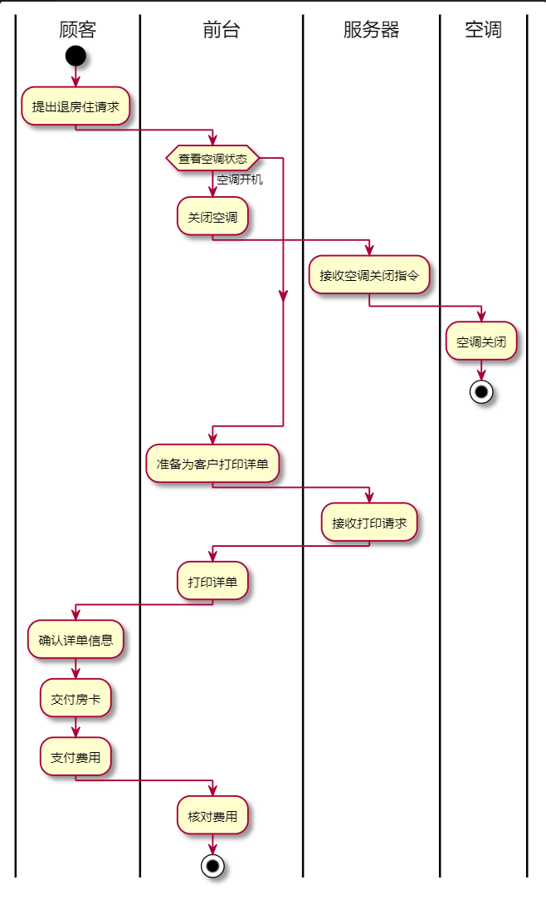
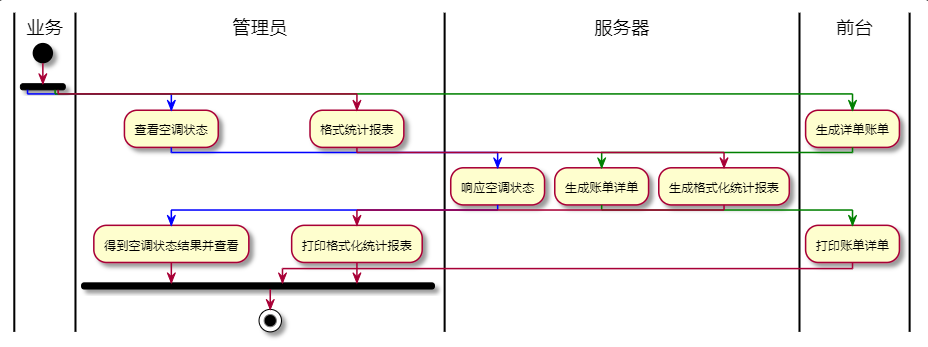

# 用户需求说明及领域模型

[TOC]

## 一、背景调研

​		近年来，随着改革开放步伐的加快和中西方文化的交流与发展，我国人民生活水平显著提高，全社会对酒店业的需求量也越来越大，随着消费的持续增长，酒店行业已经成为现代社会中发展最快的行业之一。要想在激烈的市场竞争中生存，就必须要在经营管理、住宿服务等方面提高管理意识。而对酒店的经营状况起决定性作用的是对酒店日常营业的管理。

​		如何用先进的管理手段，提高酒店的管理水平，是每一家酒店的经营者所面临的重要课题。所以应势而出的酒店分布式空调管理系统有着很好的可行应用性。一直以来，人们都采用传统人工的方式管理空调，这种管理方式存在着许多缺点，例如：效率低，保密性差，另外时间一长，将产生大量零散文件和数据，这为查找、更新和维护都带来了很多的困难，同时也加大了管理者的工作量和工作难度。

## 二、产品介绍

* 酒店的管理者可以借助本系统掌握各个房间空调的使用情况并能生成和查看格式统计报表。
* 提供可折扣的计费方式，能够适应酒店的对不同客户的优惠要求。
* 顾客可以通过该系统自主调节空调的温度、风速等，并能查看空调的计费信息。并借助前台查看详单。
* 顾客对空调的控制和服务器交互得到安全性保障，可靠性高。

## 三、业务介绍、内容及流程

### 1、业务介绍

​		主要有**顾客业务**、**管理员业务**、**前台业务**。顾客业务有开关空凋、调节空调风速与温度、查看当前空调消费的金额以及刷卡进房。前台业务有入住办理与退房办理。管理员业务有生成报表、查看流水控制所有空调总开关与设置优惠力度。

### 2、业务内容

#### 前台业务内容

​	顾客办理**入住手续**，前台将顾客手机号或其他信息发给服务器，服务器查询本地的缓存或数据库将预留的姓名、房间号以及密码返回给前台并为该顾客生成token，前台将房间号与密码告诉顾客并将房卡给顾客。

​	顾客办理**退房手续**，前台将顾客退还的房卡的房间号发给服务器，服务器修改本地缓存或数据库，并将空凋的使用时间及消费金额返回给前台，前台收取相应费用，并添加流水记录。

#### 顾客业务内容

​	办理完入住手续后，找到相应的房间**刷卡进房**，此过程将房间号与密码传给服务器，服务器查询本地的缓存或数据库返回顾客姓名，并生成token。

​	顾客进房后可以**开关空调**、**调节风速和温度**、**切换空调制冷制热模式**，将房间号、空调开关状态、空调模式、目标温度、目标风速发送给服务器，并在header里设置token，服务器验证token并修改空凋的相关状态。

​	顾客在入住期间客户端可以**显示自己消费的金额**，通过心跳包将房间号发给服务器，服务器便通过一系列查询数据并计算得出结果后返回费用。

#### 管理员业务内容

​	管理员需要手动**登录**系统，将用户名与密码发送给服务器，服务器返回管理员姓名，并生成token一起返回。

​	登录之后管理员可以：

​		**生成报表**，将当前时间发送给服务器，服务器返回一个列表，列表每个元素包括房间号、空调开关状态、当前温度、当前风速与此房间优惠力度。

​		**查看流水**，将需要查看的日期发送给服务器，服务器查询后返回列表，~~列表中每个元素包括房间名、退房时间与金额。~~**流水应该精确到最小计时粒度**

​		**控制所有空调总开关**，无需带任何参数信息，发送给服务器后服务器修改相关信息。

​		**设置单个房间的优惠力度**，将房间号与优惠力度发送送给服务器，服务器修改对应房间的优惠力度。

### 3、业务流程

#### 办理入住

* 顾客提出入住请求
* ~~前台查看剩余房间余量，若有空房则为顾客挑选房间~~
* ~~顾客确认房间并提交个人信息入住，获得房卡~~
* ~~前台确认顾客信息，确认入住，同时服务器修改相关信息~~
* 前台确认房间并将信息写入房卡，顾客获得房卡。

#### 使用空调服务

* 顾客打开~~空调~~ 客户端
* ~~空调~~ 客户端向服务器发送开机命令
* 服务器将空调设为开机状态，填充缺省状态
* 后续客户可以自行调节 ~~空调~~ 客户端的风速、温度，等待 ~~空调~~ 服务器响应；
* 服务器响应 ~~空调~~ 客户端传来的调节信息，改变空调相关参数，修改相关数据，并反馈给~~空调~~ 客户端
* ~~空调~~ 客户端响应
* ~~空调~~ 客户端周期性向服务器请求，更新付费金额。

#### 办理退房

* 顾客提出退房请求
* 前台查询空调状态，可强制关闭空调
* 前台为客户打印详单并确定退房
* 服务器修改相关数据

#### 查看空调状态/格式统计报表

* 管理员/前台查看空调状态/格式统计报表

* 服务器向客户端反馈信息

    

## 四、计费系统

### 1、计费逻辑

客户在更改空调状态之后空调向服务器发送状态变化的相关信息，服务器随后根据收到的信息修改其存储的空调状态相关信息，并更新金额，同时将必要历史信息写入数据库。除此以外，服务器周期性地或者在必要时向空调发送当前运行周期内的计费量供空调显示给客户。

### 2、服务器计费逻辑

服务器周期性的向空调发送金额信息以供显示，并在每个周期发送前和收到空调状态变化信息时更新存储的计费金额。

### 3、金额计算

#### 性能标准

* **温控范围**：16度-30度
* **风速限制**：1 ~ 3 档
* **缺省温度/启动温度**：23度

#### 计算详细

* **基础费用**：1元/度

* **电量花费**：
* 1档风 0.01度/分
    * 2档风 0.02度/分
    * 3档风 0.03度/分
    * 开机 0.5度

## 五、用户需求说明书

#### **0.** **文档介绍**

文档目的——对某快捷酒店自助计费式中央温控系统的各类具体需求进行说明。

读者对象——酒店全体客户和空调管理员。

#### **1.** **产品介绍**

本产品是为某快捷酒店设计的自助计费式中央温控系统，使得入住的客户可以根据要求设定温度和风速，同时显示当前所需支付的金额，并在客户退房时出具空调使用的账单详情。此外，本产品也可以让空调管理员监控各房间空调的使用状态，并生成格式统计报表。

#### **2.** **用户群体**

​    为某快捷酒店的全体客户和空调管理员提供便利的空调管理服务。

#### **3.** **产品标准**

​    保证酒店自助计费式中央温控系统的稳定运行，精确控制各房间空调，准确计算账单费用，正确显示空调信息，保障酒店和客户的双重利益。

#### **4.** **产品功能需求**

 <head>

</head>
<table border= "1px" >
    <caption>产品的功能需求</caption>
    <tr>
        <th>功能类别</th>
        <th>功能名称</th>
        <th>描述</th>
    </tr>
<tr>
    <td rowspan="5"> 客房客人 </td>
    <td>开关机</td>
    <td>客人可以对本房间的空调进行开关机</td>
</tr>
<tr>
    <td>调节温度</td>
    <td>客人可以对本房间空调的温度在给定范围内调节</td>
</tr>
<tr>
    <td>调节风速</td>
    <td>客人可以对本房间空调的风速在给定范围内调节 </td>
</tr>
<tr>
    <td>查询费用</td>
    <td>客人可以查询本次开启空调产生的费用，也可以看到空调的计费规则</td>
</tr>
<tr>
    <td>查询账单</td>
    <td>客人可以查询空调使用的详细情况，在什么时候开机关机，以及每次开机运行产生的费用 </td>
</tr>
<tr>
    <td rowspan="4"> 酒店前台与管理 </td>
    <td>监控个房间空调的使用状态</td>
    <td>酒店的管理可以实时显示所有房间（或者查询指定房间）的空调状态，包括开关机状态，当前设定温度，当前风速，当前费用</td>
</tr>
<tr>
    <td>更改房间空调状态</td>
    <td>管理员可以修改空调的开关机状态，以及风速温度</td>
</tr>
<tr>
    <td>查询详单</td>
    <td>管理员可以查询指定房间的空调的详单，在什么时候开机关机，以及每次开机运行产生的费用</td>
</tr>
<tr>
    <td>查询费用</td>
    <td>管理员可以查看所有房间的空调总费用，也可以查看指定房间的费用情况</td>
</tr>    
</table>

#### 5**.** **产品非功能需求**

| 需求类别 | 需求名称   |                            描述                             |
| -------- | ---------- | :---------------------------------------------------------: |
| 性能需求 | 实时性     | 每秒刷新房间空调状态和计费金额，在1秒内响应并处理控制命令。 |
|          | 精确度     |       以1秒为时间单位精确计量空调使用时间并计算费用。       |
| 环境需求 | 软件需求   |        支持空调嵌入式操作系统和各大主流计算机系统。         |
|          | 硬件需求   |             嵌入式空调卡机、各类商业化计算机。              |
|          | 使用需求   |            仅供入住的客户和酒店空调管理员使用。             |
| 质量需求 | 可靠性需求 |          稳定运行、精确控制、准确计费、正确显示。           |
|          | 安全需求   |         保障系统安全，防止恶意修改计费金额等行为。          |

## 六、领域模型

### UML类图设计

### 活动图设计

* 总体活动

    

* 办理入住

    

* 使用空调服务

* .png)

* .png)

* 

    .png)

* 办理退房

    

* 查看空调状态/格式统计报表

