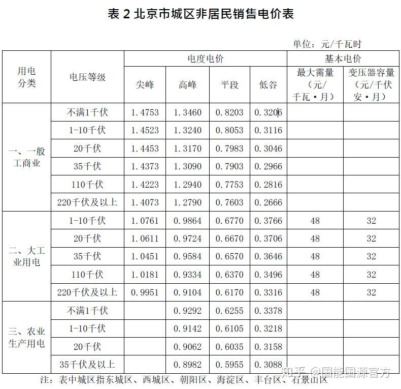

# Phase3 目前可以公开的情报

* 要求详见“波普特简介改（2）.docx”

## 程序

### 开发环境

* Windows10 20H2、macOS 11.2.3、centOS 7.9、Ubuntu 20.04
* 测试浏览器 ：
	* Chrome 89.0.4389.128 (Official Build) (x86_64)
	* 补充

### 技术栈

* 前端：基础三件套：HTML+CSS+JavaScript——应用框架：Vue.js（Vue3）——UI 框架：ViewUI，标准：ES6
	* 网络：HTTP、存储：Vuex、路由：Vue-axios
	* （新）报表可视化展示：待定
	* 为了实现读取用户卡片信息（接收读卡器信息）功能，可能需要使用 Electron 封装为应用程序，输密码太挫且不符合老师要求
* 后端：语言：Python、数据库：MySQL（剩下的说明后端同学自己补充）
	* 补充

### 工具链

* 前端：Node.js、Webpack
	* IDE（不一定一致）：Webstorm 2021.1
* 后端：补充

### 前端待完善内容

* 管理员、前台、经理的GUI
* 客户、管理员、前台、经理的程序逻辑
* 报表可视化展示（找个库吧）

### 后端待完善内容

* 调度员角色

* 代码结构及数据库重构
* 补充

## 文档

### 空调参数

* 致冷范围：16-24 度、制热范围：22-28 度。缺省目标温度：24 度。
* 具有动态分配功率功能：基于付费金额的优先级服务策略、时间片轮转策略。

### 计费规则

* 参考要求，低速风 0.5 元/度，中速风 1 元/度，高速风 2 元/度。

* 卷卷方案：估算房间热交换效率计算大致制冷量需求，换算为空调功耗。此方案需要获知实时室温。

### 日志策略

#### 用户侧

* 每次风速变化会产生一条新的详单记录、停止或中断服务会产生一条详单记录。（个人理解：设定目标温度只是设定了一条新的“温差-风速曲线”，耗电量多少仅由风速（交换机功率）决定）
* 打印详单功能由前台端提供。

#### 经理侧

* 需出具日报、周报
* 包含：房间号、开关次数、调度次数、详单条数、调温次数、调风次数、请求时长（？）、总费用，以折线图或饼图形式展现。
* 打印详单功能由经理端提供。

