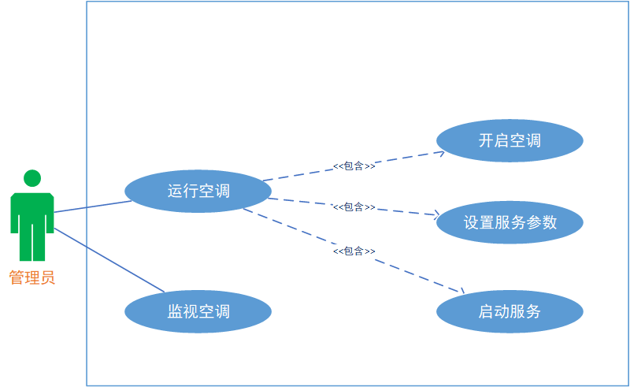

[toc]

# 1.文档介绍

## 1.1 文档目的

​		本文档基于用户需求说明书和用户详细要求对分布式温控系统进行了更加细致、深入的需求分析，目的在构建领域模型后构建用例模型，以此来清楚地、无二义性地描述用户需求。用例模型是对业务需求的理解，对一些场景进行整理和分析，使用用例图清晰地表达对系统功能的要求。因此，对于用户来说，本文档通过图表的方式展示了系统的功能模块、交互流程等，有利于用户进一步确认需求，以免后续开发出现偏差；对于开发人员来说，本文档帮助开发人员了解业务背景知识，有助于他们把握住一些全局性的概念及核心流程，同时给出了系统中的基本架构和各种用例，为后续具体设计和模块组织提供了基础。

## 1.2 文档范围

​		本文档包括分布式温控系统的用例图、系统顺序图和操作契约部分。主要角色有住户、空调管理员、前台人员、酒店经理和空调调度员，针对某一特定角色的功能都由用例图、用例说明和系统顺序图进行需求内容的详细说明。

## 1.3 读者对象

​		本说明书的读者对象包括客户代表（即需求方，也即BUPT酒店管理方）以及软件开发方（即项目产品经理、设计人员、编码人员、测试人员和维护人员等）

## 1.4 参考文档

1. 本小组《[用户需求说明及领域模型》
2. 肖丁，修佳鹏. 软件工程模型与方法（第2 版）[M]. 北京：北京邮电大学出版社,2014.08.

## 1.5 术语约定

 * 空调管理员：空调管理员负责空调的运行和维护。
 * 用户：入住酒店并使用本系统的顾客。
 * 出风口：即分布式中央空调系统的室内出风口。
 * 客户端：在本项目中，客户端终端用于给客户提供图形化界面以调整其房间内的空调设定和计费。
 * 服务员端：在本项目中，用于给酒店方人员提供图形化界面以进行空调状态查询，报表查看，详单打印等功能。
    * 空调管理员端：用于给空调管理员提供图形界面来进行空调开机和运行，监控各客房的分机的运行状态；
    * 前台端：用于给前台提供图形界面来进行接待顾客、办理顾客酒店入住、办理顾客退房以及出具账单和详单；
    * 酒店经理端：用于给酒店经理提供图形界面来进行全面负责酒店的运营并关注酒店的空调的运营数据：日报、周报
    
 * 用例：参与者为了完成某些特定的任务而必须执行的一系列动作的合集。
 * 问题域边界：用来说明当前讨论用例图应用的范围，用一个矩形表示。
 *  用例图：由参与者、用例，边界以及它们之间的关系构成的用于描述系统功能的
视图。

# 2.项目背景

​		波普特（BUPT）廉价酒店位于帝都五环外的大学城附近，周边环境优美清幽，适合旅游度假放松心情。该酒店成立于2000年，经过10年的经营积攒了良好的声誉，为了响应政府绿色环保经营的理念，期望构建空调温控计费系统：推崇多用多付出，少用少付出，不用不付出的计费模式，节省成本的同时使得顾客随时能查看已消费的金额，做到心中有数节省开支的目的，进一步吸引年轻人入住。顾客入住酒店时需要提供身份证，可以预约登记或者现场申请办理入住。经过前台接待人员的身份核查后，根据顾客入住的天数需缴纳一定的押金，之后前台进行登记安排客房并提供门卡及wifi密码。中央空调运行期间维护人员通过顾客的投诉和报修信息进行空调问题的处理，无法及时掌控各房间空调的运行情况。由于空调处理能力的问题（假定，同一时间只能提供3个房间的温控请求），短时间内又不能改装并提升空调的功率且又不方便向顾客直言其中的原因，为此希望新系统具有动态分配空调资源的能力，以便顾客不会感受到其中的不便之处。该酒店由于规模有限不提供餐饮服务，但客房中会提供必备的瓶装矿泉水及热水壶等基本设备。酒店提供集中式空调，客房具有空调的控制面板和出风口。顾客进入房间后通过门卡接通房间电源。当顾客离开酒店退房时，前台负责结算房费，当前在没有引入新系统的情况下前台只负责收取房费，房费包含了空调使用费，尽管顾客没有使用空调也会默认收取。

# 3.用例图

## 3.1 顾客用例图

## 3.2 前台用例图

## 3.3 空调管理员用例图

## 3.4 酒店经理用例图

# 4.系统顺序图

## 4.1 顾客系统顺序图

### 4.1.1 使用空调

## 4.2 前台系统顺序图

### 4.2.1 出具账单

### 4.2.2 出具详单

## 4.3 空调管理员系统顺序图

### 4.3.1 运行空调

### 4.3.2 监视空调

## 4.4 酒店经理系统顺序图

### 4.4.1 查看运营报告

# 5.操作契约

## 5.1 顾客相关操作契约

<table border="1">
<tr>
<td>系统事件</td>
<td>ChaneAirConditioner(temprature,mode,pattern)</td>
</tr>
<tr>
<td>交叉引用</td>
<td>使用空调</td>
</tr>
<tr>
<td>前置条件</td>
<td>用户身份验证通过，开始处理指令</td>
</tr>
<tr>
<td rowspan="4">后置条件</td>
<td>(1)调度对象与对应房间建立关联</td>
</tr>
<tr>
<!--td></td-->
<td>(2)如果该请求的房间有服务对象，则调度对象与服务对象建立关联</td>
</tr>
<tr>
<!--td></td-->
<td>(3)如果该请求的房间在等待队列，则调度对象修改等待队列中的目标温度、风速和模式为给定值</td>
</tr>
<tr>
<!--td></td-->
<td>(4)将本次修改运行记录存入服务器</td>
</tr>

<table border="1">
<tr>
<td>系统事件</td>
<td>GettheCost()</td>
</tr>
<tr>
<td>交叉引用</td>
<td>使用空调</td>
</tr>
<tr>
<td>前置条件</td>
<td>用户身份验证通过，开始处理指令</td>
</tr>
<tr>
<td rowspan="2">后置条件</td>
<td>(1)服务器内空调花费金额更新</td>
</tr>
<tr>
<!--td></td-->
<td>(2)将本次查询运行记录存入服务器</td>
</tr>

<table border="1">
<tr>
<td>系统事件</td>
<td>TurnonAC(roomid,temprature)</td>
</tr>
<tr>
<td>交叉引用</td>
<td>使用空调</td>
</tr>
<tr>
<td>前置条件</td>
<td>无</td>
</tr>
<tr>
<td rowspan="6">后置条件</td>
<td>(1)调度对象与房间建立关联</td>
</tr>
<tr>
<!--td></td-->
<td>(2)一个服务对象被创建</td>
</tr>
<tr>
<!--td></td-->
<td>(3)调度对象与服务对象建立关联</td>
</tr>
<tr>
<!--td></td-->
<td>(4)服务对象与房间建立关联</td>
</tr>
<tr>
<!--td></td-->
<td>(5)调度对象的服务对象数及服务开始时间被赋值</td>
</tr>
<tr>
<!--td></td-->
<td>(6)服务对象的服务状态，服务开始时间，模式，目标温度，费率及费用值被赋值，返回对应token</td>
</tr>

<table border="1">
<tr>
<td>系统事件</td>
<td>TurnoffAC(rid):</td>
</tr>
<tr>
<td>交叉引用</td>
<td>使用空调</td>
</tr>
<tr>
<td>前置条件</td>
<td>无</td>
</tr>
<tr>
<td rowspan="4">后置条件</td>
<td>(1)调度对象与房间删除关联</td>
</tr>
<tr>
<!--td></td-->
<td>(2)服务对象与房间删除管理</td>
</tr>
<tr>
<!--td></td-->
<td>(3)服务对象的服务时长和费用被修改</td>
</tr>
<tr>
<!--td></td-->
<td>(4)销毁token</td>
</tr>

<table border="1">
<tr>
<td>系统事件</td>
<td>statusrequest(roomid):</td>
</tr>
<tr>
<td>交叉引用</td>
<td>使用空调</td>
</tr>
<tr>
<td>前置条件</td>
<td>无</td>
</tr>
<tr>
<td rowspan="4">后置条件</td>
<td>(1)调度对象与房间建立关联</td>
</tr>
<tr>
<!--td></td-->
<td>(2)当前服务对象数大于等于服务对象数上限，则将房间的请求放到等待队列进行调度</td>
</tr>
<tr>
<!--td></td-->
<td>(3)队列中的等待服务的房间的等待时长被赋值</td>
</tr>
<tr>
<!--td></td-->
<td>(4)调度对象保存</td>
</tr>

## 5.2 前台相关操作契约

<table>
    <tr>
        <td>系统事件</td>
        <td>CreateRDR(RoomId,date_in,date_out)</td>
    </tr>
    <tr>
        <td>交叉引用</td>
        <td>出具详单</td>
    </tr>
    <tr>
        <td>前置条件</td>
        <td>顾客已办理入住</td>
    </tr>
    <tr>
        <td rowspan="4">后置条件</td>
        <td>(1)服务对象被创建</td>
    </tr>
    <tr>
        <!--td></td-->
        <td>(2)详单对象被创建</td>
    </tr>
    <tr>
        <!--td></td-->
        <td>(3)详单的所有属性被赋值</td>
    </tr>
</table>

<table>
    <tr>
        <td>系统事件</td>
        <td>PrintRDR(RoomId,list_RDR)</td>
    </tr>
    <tr>
        <td>交叉引用</td>
        <td>出具详单</td>
    </tr>
    <tr>
        <td>前置条件</td>
        <td>顾客已办理入住</td>
    </tr>
    <tr>
        <td>后置条件</td>
        <td>(1)详单文件被创建；</td>
    </tr>
</table> 

<table>
    <tr>
        <td>系统事件</td>
        <td>CreateInvoice(RoomId,date_in,date_out)</td>
    </tr>
    <tr>
        <td>交叉引用</td>
        <td>出具账单</td>
    </tr>
    <tr>
        <td>前置条件</td>
        <td>顾客已办理入住</td>
    </tr>
    <tr>
        <td rowspan = 3>后置条件</td>
        <td>(1)服务对象被创建</td>
    </tr>
    <tr>
        <!--td></td-->
        <td>(2)账单对象被创建</td>
    </tr>
    <tr>
        <!--td></td-->
        <td>(3)账单对象的所有属性被赋值</td>
    </tr>
</table> 

<table>
    <tr>
        <td>系统事件</td>
        <td>PrintInvoice(RoomId,date_out,Toal_fee)</td>
    </tr>
    <tr>
        <td>交叉引用</td>
        <td>出具账单</td>
    </tr>
    <tr>
        <td>前置条件</td>
        <td>顾客已办理入住</td>
    </tr>
    <tr>
        <td>后置条件</td>
        <td>(1)详单文件被创建；</td>
    </tr>
</table> 

## 5.3 空调管理员相关操作契约

<table>
    <tr>
        <td>系统事件</td>
        <td>PowerON()</td>
    </tr>
    <tr>
        <td>交叉引用</td>
        <td>开启空调主机电源</td>
    </tr>
    <tr>
        <td>前置条件</td>
        <td>无</td>
    </tr>
    <tr>
        <td>后置条件</td>
        <td>(1)返回状态(设置服务参数状态)</td>
    </tr>
</table>

<table>
    <tr>
        <td>系统事件</td>
        <td>setPara(Mode,Temp_highLimit,Temp_lowLimit,default_TargetTemp,FeeRate_H,FeeRate_M,FeeRate_L）</td>
    </tr>
    <tr>
        <td>交叉引用</td>
        <td>设置服务参数</td>
    </tr>
    <tr>
        <td>前置条件</td>
        <td>开启空调主机电源</td>
    </tr>
    <tr>
        <td>后置条件</td>
        <td>(1)返回ok</td>
    </tr>
</table>

<table>
    <tr>
        <td>系统事件</td>
        <td>StartUp()</td>
    </tr>
    <tr>
        <td>交叉引用</td>
        <td>启动空调服务</td>
    </tr>
    <tr>
        <td>前置条件</td>
        <td>设置服务参数</td>
    </tr>
    <tr>
        <td>后置条件</td>
        <td>(1)返回状态(就绪状态)</td>
    </tr>
</table>

<table>
    <tr>
        <td>系统事件</td>
        <td>CheckRoomState(list_Room)</td>
    </tr>
    <tr>
        <td>交叉引用</td>
        <td>管理员启动监视各房间空调状态，每分钟刷新一次状态</td>
    </tr>
    <tr>
        <td>前置条件</td>
        <td>无</td>
    </tr>
    <tr>
        <td>后置条件</td>
        <td>(1)返回各房间的状态信息：状态信息：（是否开机，是否正在服务，是否被挂起），当前室温，目标温度，风速，费率，费用，服务时长；</td>
    </tr>
</table>

## 5.4 酒店经理相关操作契约

<head>

</head>
<table border= "1px" >
    <tr>
        <td colspan="1">系统事件</td>
        <td colspan="1">login(string username,string password)</td>
    </tr>
    <tr>
        <td colspan="1">交叉引用</td>
        <td colspan="1">酒店经理登录</td>
    </tr>
    <tr>
        <td rowspan="1">前置条件</td>
        <td colspan="1">无</td>
    </tr>
    <tr>
        <td rowspan="2">后置条件</td>
        <td colspan="1">(1)返回登陆成功或者失败</td>
    </tr>
    <tr>
       <td colspan="1">(2)登录成功，返回ok时带上token</td>
    </tr>
</table>

<head>

</head>
<table border= "1px" >
    <tr>
        <td colspan="1">系统事件</td>
        <td colspan="1">getdailyreport（int date</td>
    </tr>
    <tr>
        <td colspan="1">交叉引用</td>
        <td colspan="1">生成运营日报</td>
    </tr>
    <tr>
        <td rowspan="1">前置条件</td>
        <td colspan="1">酒店经理登陆系统，点击查看运营数据日报</td>
    </tr>
    <tr>
        <td rowspan="2">后置条件</td>
        <td colspan="1">(1)系统计算相关数据</td>
    </tr>
    <tr>
       <td colspan="1">(2) 日报相关属性被修改</td>
    </tr>
</table>

<head>

</head>
<table border= "1px" >
    <tr>
        <td colspan="1">系统事件</td>
        <td colspan="1">getmonthreport（int month）</td>
    </tr>
    <tr>
        <td colspan="1">交叉引用</td>
        <td colspan="1">生成运营月报</td>
    </tr>
    <tr>
        <td rowspan="1">前置条件</td>
        <td colspan="1">酒店经理登陆系统，点击查看运营数据月报</td>
    </tr>
    <tr>
        <td rowspan="2">后置条件</td>
        <td colspan="1">(1)系统计算相关数据</td>
    </tr>
    <tr>
       <td colspan="1">(2) 月报相关属性被修改</td>
    </tr>
</table>