# 软件工程概述

* 软件是包括程序、数据及其相关文档的完整集合。
* 软件开发至今未完全摆脱手工艺的开发方式。
* 软件危机：60-70s之间的软件快速发展阶段。
* 软件工程：运用工程化原则和方法，组织软件开发解决软件危机。
* 软件发展阶段：
    * 
* 软件工程定义：
    * 为了<u>经济地</u>获得能够在实际机器上高效运行的<u>可靠软件</u>而建立和使用的一系列好的<u>工程化原则</u>。
    * 运用现代科学技术知识来设计并构造计算机程序，及为开发、运行、维护这些程序必需的<u>相关文件资料</u>。
    * 在<u>成本限额以内按时</u>完成开发和修改软件产品所需的系统生产和维护的技术和管理的学科。
    * IEEE定义：1、应用<u>系统化的、规范化的、定量的方法</u>来开发、运行、维护软件，即<u>将工程应用到软件</u>。2、对1中各种方法的研究。
* 软件工程三要素：方法、工具和过程
    * 方法：提供了“如何做”的技术
    * 工具：提供自动或半自动的软件支撑环境
    * 过程：将软件工程的方法和工具综合起来达到合理、及时地进行计算机软件开发的目的
* 软件工程的目标：在给定成本和时间的前提下，开发出满足用户需求且具有正确性、可用性等因素的软件产品。
* 软件工程的终极目标：摆脱手工生产软件的状况，逐步实现软件研制和维护的自动化。

# 软件生命周期模型

* 工程项目三个基本目标：合理的进度、有限的经费、一定的质量
* <u>软件工程过程</u>是为了获得软件产品，在软件工具的支持下由软件工程师完成的一系列软件工程活动。主要活动：
    * 软件规格说明：规定软件功能及其使用限制
    * 软件开发：产生满足规格说明的软件
    * 软件确认：通过有效性验证以保证软件能够满足客户要求
    * 软件演进：为了满足客户变更要求，软件在使用过程中不断地改进
* 软件生命周期：制定计划、需求分析、设计、程序编码、测试、运行维护
* 传统模型种类：瀑布模型、演化模型、增量模型、喷泉模型、V&W模型、螺旋模型、构件组装模型、快速应用开发模型、原型方法。

## 瀑布模型

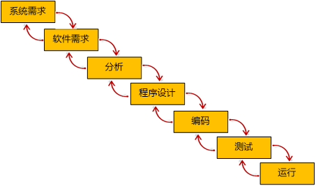

* 优点：降低软件开发复杂度、提高过程透明性和可管理性。推迟了软件实现，强调在软件实现前必须进行分析和设计工作。以项目阶段评审和文档控制为手段对整个开发过程进行指导。
* 缺点：模型缺乏灵活性，无法解决软件需求不明确或不准确的问题。模型的风险控制能力较弱。文档驱动极大地增加了工作量，仅凭文档评审容易得到错误结论。

## 演化模型

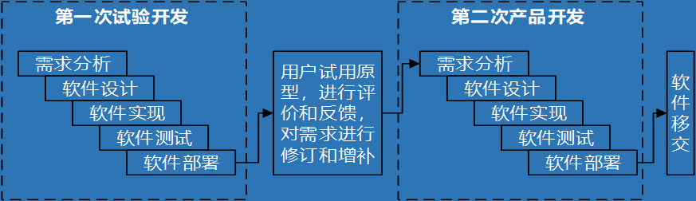

* 优点：明确用户需求、提高系统质量、降低开发风险。
* 缺点：难于管理、结构较差、技术不成熟。可能抛弃瀑布模型的文档控制优点。可能导致最终的软件系统结构较差。

## 增量模型

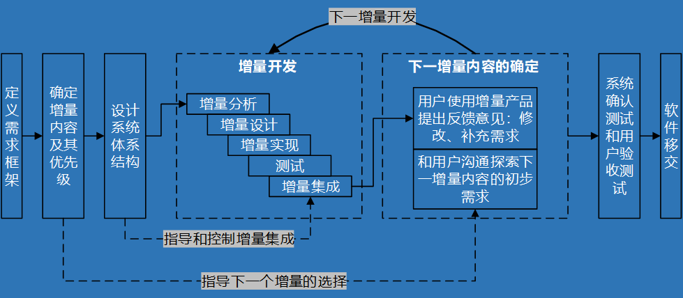

* 优点：先开发核心内容、风险较低、可靠性较强。
* 缺点：增量粒度难以选择、在开始确定所有需求比较困难。

## 喷泉模型（迭代模型）

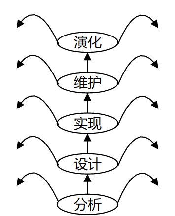

* 优点：提高开发效率。缩短开发周期。
* 缺点：难于管理。

## V&W模型

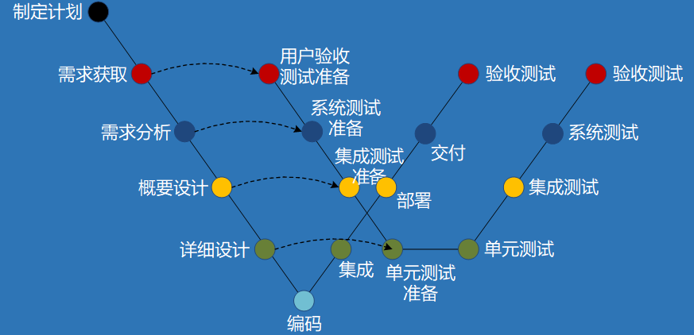

瀑布模型将测试作为软件实现之后的一个独立阶段，使得在分析和设计阶段潜伏下来的错误得到纠正的时机大为推迟，造成较大的返工成本；而且体系结构级别的缺陷也只能在测试阶段才能被发现，使得瀑布模型驾驭风险的能力较低。

瀑布模型将测试阶段独立于编码之后，给人们造成了一种不良的影响，即：相对于编码而言，分析与设计工作更重要，而并没有强调测试的重要性，尽管测试有时会占据项目周期的一半时间。V模型的价值在于纠正了人们这种错误的认识，将测试分等级，并和前面的开发阶段对应起来。

## 螺旋模型

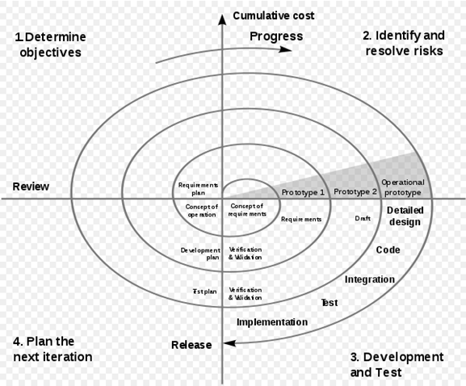

风险分析、制定计划、实施工程、客户评估四个阶段。适用于大型项目，逐渐明确需求、有效降低风险。

## 构件组装模型

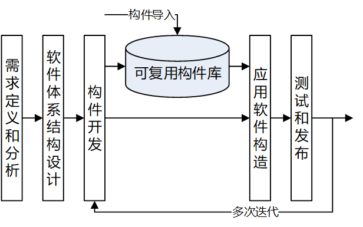

* 优点：充分利用软件复用，提高开发效率。允许多个项目同时开发，降低费用、提高可维护性，实现分步提交软件产品。
* 缺点：缺乏通用的构件组装结构标准风险较大。构件可重用性和系统高效性之间不易协调。过于依赖构件使得构件质量影响最终产品质量。

## 快速应用开发模型

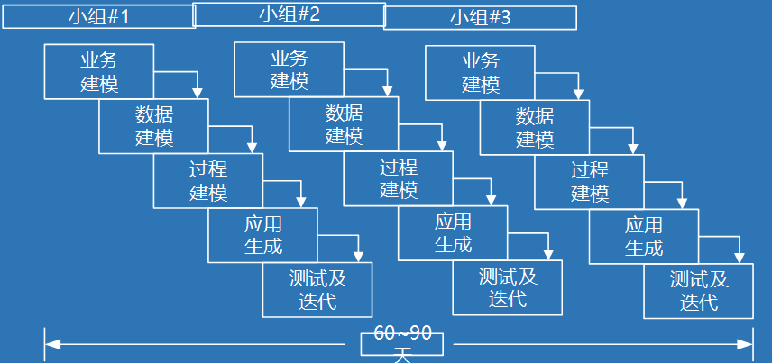

* 优点：极短的开发周期。
* 缺点：沟通配合不当容易导致开发失败。不适合开发技术风险性较高、与外围系统互操作性较高的系统。

## 原型方法

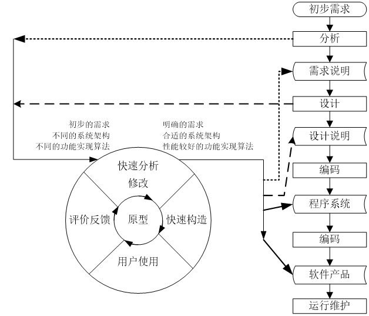

*
优点：原型方法有助于快速理解用户对于需求的真实想法。可以容易地确定系统的性能，确认各项主要系统服务的可应用性，确认系统设计的可行性，确认系统作为产品的结果。软件原型的最终版本，有的可以原封不动地成为产品，有的略加修改就可以成为最终系统的一个组成部分，这样有利于建成最终系统。

*
缺点：大型系统如不经过系统分析得到系统的整体划分，而直接用原型来模拟是很困难的。对于大量运算的、逻辑性较强的程序模块，原型方法很难构造出该模块的原型来供人评价。对于原有应用的业务流程、信息流程混乱的情况，原型构造与使用有一定的困难。文档容易被忽略。建立原型的许多工作会被浪费掉。项目难以规划和管理。

## RUP，Rational Unified Process

* 将软件生命周期分为四个阶段：初始阶段、细化阶段、构造阶段、交付阶段。

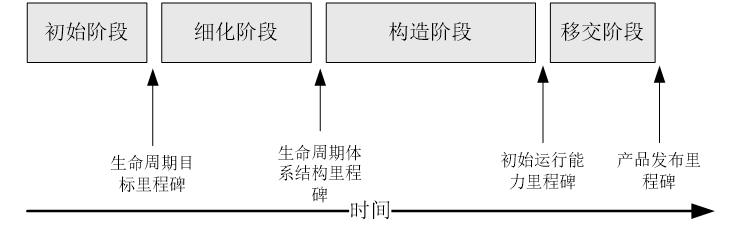

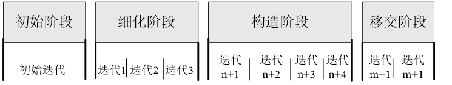

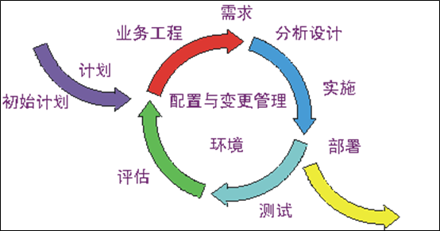

# 软件需求分析

* 软件的系统分析
  * 预研
  * 可行性分析
  * 签订软件开发合同
* 需求的定义：研究一种无二义性的表达工具，它能为用户和软件人员双方都接受，并能够把需求严格地、形式地表达出来。
* 需求分析的必要性：在系统需求分析和软件设计之间起到桥梁的作用。
  * 允许软件开发人员对关键问题进行细化，并构建相应的分析模型：
    * 数据模型：那些数据进出系统、哪些数据需要存储？
    * 功能模型：对数据进行处理的功能有哪些？
    * 行为模型：数据进出系统和被系统功能处理的场景
  * 需求规格说明书为软件测试人员提供了软件质量评估的依据。
* 需求分析的对象、任务、目标：
  * 对象：用户要求
  * 任务：准确定义新系统的目标，回答必须“做什么”的问题
  * 目标：导出目标系统的逻辑模型，解决“做什么”的问题

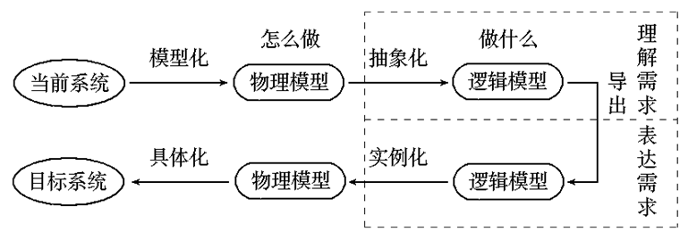

* 需求分析的原则：
  * 操作性原则：
    * 问题的<u>信息域</u>必须被表示和理解。
    * 软件的<u>功能</u>必须被定义。
    * 软件的<u>行为</u>必须被表示。
  * 工程化原则：
    * 正确理解问题，建立分析模型。
    * 记录需求的起源及原因，保证需求的可回溯性。
    * 开发一个人机交互过程的原型。
    * 给需求赋予优先级。
    * 努力删除歧义性。
* 数据、功能、行为建模
  * 数据模型：信息内容和关系、信息流、信息结构
  * 功能模型：对进软件的信息数据进行变换处理的模块。包含输入、处理、输出。
  * 行为模型：软件对来自外界的事件做出反应。状态自动机。

## 需求工程

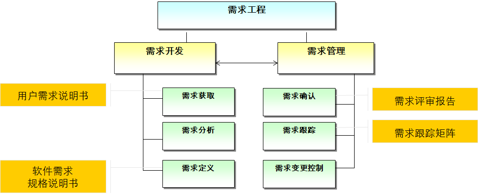

* 需求获取：清楚理解所要解决的问题，完整获得用户的需求。并提出实现需求的条件，以及需求应达到的标准。

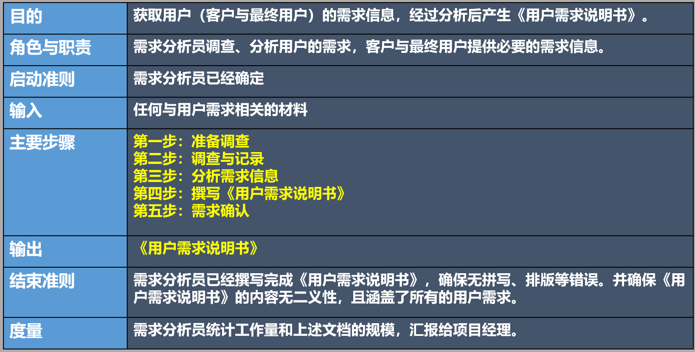

* 用户需求说明书与软件需求规格说明书的区别：前者主要采用自然语言来表达用户需求，后者采用规范的建模语言表示。<u>后者是前者的细化，更多地采用计算机语言和图形符号来刻画需求。软件需求规格说明书是软件系统设计的直接依据。</u>
* 需求类别：
  * 功能需求、性能需求、环境需求。
  * 其他：可靠性需求、安全保密需求、用户界面需求、资源使用需求、软件成本消耗与开发进度需求、预先估计以后系统可能达到的目标。
* 需求的分析与综合：<u>需求获取之后需要对比较复杂的需求进行建模分析。</u>
* 需求的定义：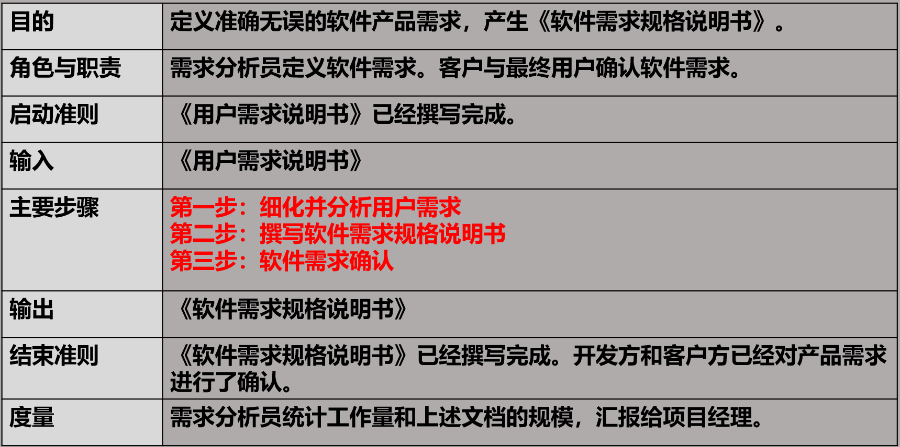
* 需求建模：着重描述系统必须做什么，而非如何去做系统。
  * 给出<u>当前系统及目标系统的逻辑视图</u>，以及<u>当前系统的物理视图</u>。
    * 逻辑模型给出软件要达到的功能和处理数据之间的关系，而不是实现的细节。
    * 物理模型给出业务环境中的业务实体以及业务处理流程，是抽象出当前系统逻辑模型的基础。

* 总结：
  * 需求是复杂的。
  * 需求分析是必须的。
  * 需求必须从三个方面描述。
  * 需求分析后必须以规范的方式进行描述，形成需求规格说明书。
  * 需求最终必须被客户认可。

# 面向对象需求分析方法

## UML统一建模语言

* UML的主要特点：是一种标准的图形化建模语言，是面向对象分析与设计的一种标准表示。
  * 不是程序设计语言，是一种可视化的<u>建模</u>语言。
  * 是一种建模语言规格说明，是一种表示的标准。
  * 不是过程也不是方法，<u>但允许任何一种过程或方法使用它</u>。
* UML基本结构：
  * 基本构造块Basic building block
    * 事物Thing
      * Structural thing
        * 类class、接口interface、collaboration、use case、component、node
      * Behavior thing
        * interaction、state machine
      * Group thing
        * package
      * Annotation thing
        * note
    * 关系Relationship
      * 依赖Dependency
      * 关联Association
      * 泛化Generalization
      * 实现Realization
    * 图Diagram
  * 语义规则Rule
    * name、scope、visibility、integrity、execution
  * 通用机制Common mechanism
    * specification、adornment、common division、extensibility mechanism
* UML的4+1视图

* 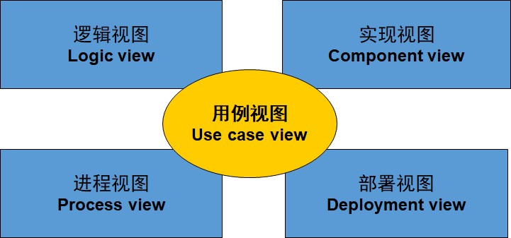
  * 用例视图（用户模型视图、场景视图）：强调从用户角度看到的或需要的系统功能。
  * 逻辑视图（结构模型视图、静态视图）：展现系统的静态或结构组成及特征。
  * 进程试图（行为模型视图、过程视图、协作视图、动态视图）：描述设计的并发和同步等特性，关注系统非功能性需求。
  * 构件视图（实现模型视图、开发视图）：关注代码的静态组织与管理。
  * 部署视图（环境模型视图、物理视图）：描述硬件的拓扑结构以及软件和硬件的映射问题，关注系统非功能性需求（性能、可靠性等）。
* UML的9个基本图：
  * 用例图：从用户的角度描述系统的功能
  * 类图：描述系统的静态结构（类及其相互关系）
  * 对象图：米哦按花素系统在某个时刻的静态结构（对象及其相互关系）
  * 顺序图：按时间顺序描述系统元素间的交互
  * 协作图：按照时间空间的顺序描述系统元素间的交互和他们之间的关系
  * 状态图：描述系统元素（对象）的状态条件和响应
  * 活动图：描述了系统元素之间的活动
  * 构件图：描述了实现系统的元素（类或包）组织
  * 部署图：描述了环境元素的配置并把实现系统的元素映射到配置上
* UML图的关系：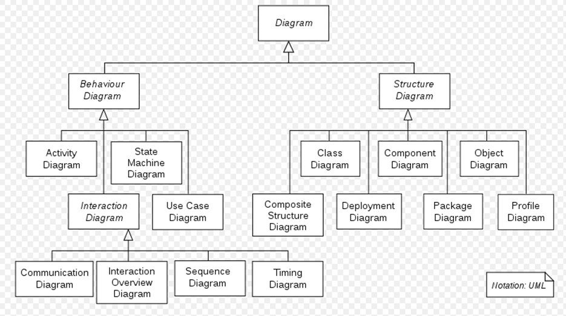
* UML视图与图的关系：
  * 用例视图——用例图
  * 逻辑视图——类图、对象图、顺序图/协作图
  * 进程试图——状态图、活动图
  * 构件视图——构件图
  * 部署视图——部署图
* 面向对象的需求分析建模：
  * 领域模型：表示当前系统逻辑模型的静态结构及业务流程。针对一个特定领域，抽象客观事物将其可视化。
  * 用例模型：目标系统的逻辑模型，定义目标系统做什么的需求
  * 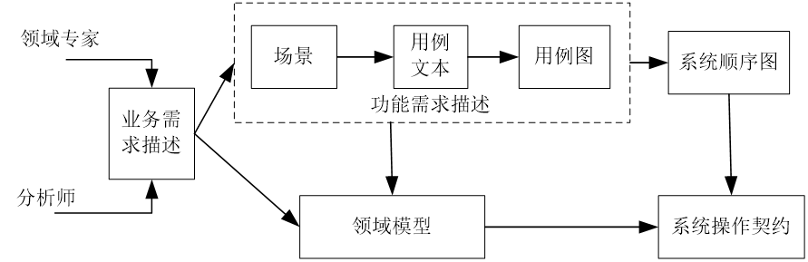

## 领域模型

* 识别概念类：名词可以是概念类，也可能是概念类中表示特征的属性。
  * 属性一般是可以被赋值的，如果一个名词不能被赋值，那么有可能是一个概念类。
  * 如果对于是概念类还是属性举棋不定，将其作为概念类处理。
  * 不存在名词到类的映射机制，因为自然语言具有二义性。
* 创建领域模型的步骤：
  * 找出当前需求中的<u>候选概念类</u>
  * 在领域模型中描述这些<u>概念类</u>。用问题域中的词汇对概念类进行命名，将与当前需求无关的概念类排除在外。
  * 在概念类之间<u>添加必要的关联</u>来记录那些需要保存记忆的关系。
  * 在概念类中<u>添加</u>用来实现需求的必要<u>属性</u>。

## 用例模型

* 由四个部分组成：用例图、用例说明、系统顺序图SSD、操作契约Operation contract

### 用例图

* 用例图组成：

  * Actor：表示使用系统的对象
  * Use Case：用例，描述角色如何使用系统功能实现需求目标的一组成功场景和一系列失败场景的集合
  * Association：角色与用例、用例和子用例之间的关系

* 基本用例：与角色直接相关的用例

* 子用例：与角色无直接关系，与基本用例存在关联关系的用例

  * 包含子用例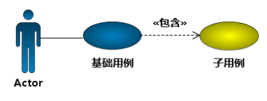
  * 扩展子用例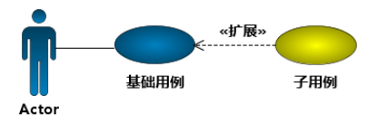

### 系统顺序图

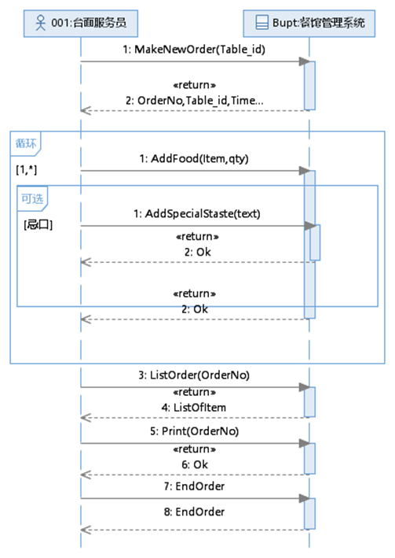

* 注意：
  * SSD是用于替代用例说明文本的一种方式；
  * 图中只有两个对象，表示角色对象与系统对象；
  * 图中的消息名称及参数要求以可编程的方式命名；
  * 消息名称和参数可以通过一个列表使用中文说明具体含义；
  * 用例图中的每个用例都应该对应一张SSD；
  * 角色发给系统的指令（系统事件）是操作契约关注的元素

## 操作契约

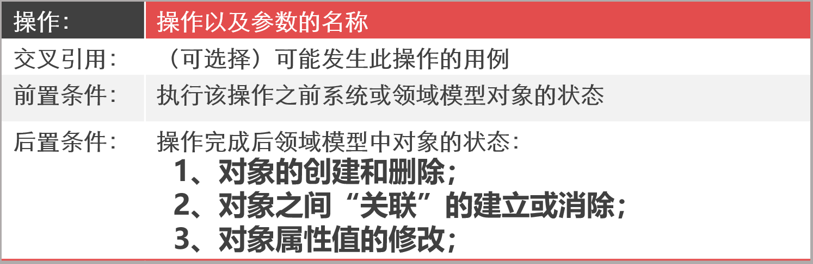

* 创建操作契约：
  * 根据SSD<u>识别</u>进入到系统内的所有系统事件（操作）
  * 针对每一个系统操作，结合对应的领域模型，找到与此操作相关的概念类
  * 定义概念类响应该操作的以下三项内容：
    * 对象实例创建和删除
    * 对象关联形成和断开
    * 对象属性修改
  * 后置条件非空，该操作才有存在的必要性。
  * 后置条件的陈述应该是声明性的。

# 结构化需求分析方法

* 分析模型的结构
  * 需求分析的分析模型必须达到三个主要目标：
    * 描述客户的需求
    * 建立创建软件设计的基础
    * 定义在软件完成后可以被确认的一组需求
  * 结构化分析模型的组成：
    * 数据流图：描述功能模型
    * ER图、数据词典：描述数据模型
    * 状态迁移图：描述行为模型

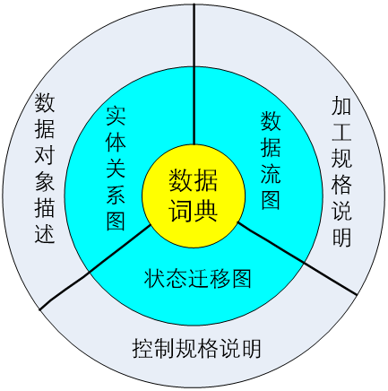

* 数据对象（实体）：
  * 外部实体：产生或使用消息的任何事物

* 数据流图：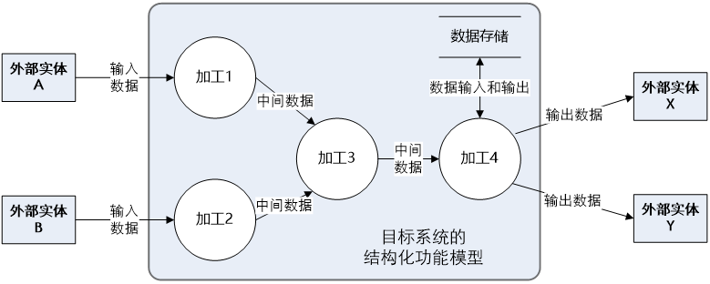

* 四种基本元素：加工、外部实体、数据流、数据存储

* 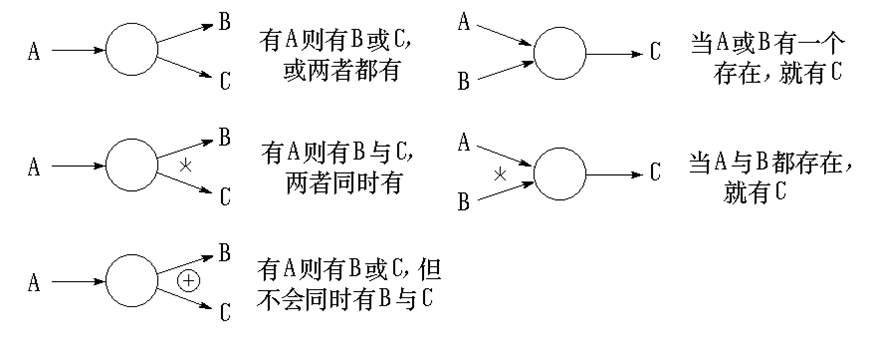

* 分层数据流图：

  * 顶层数据流图：仅包含一个加工，代表被开发系统，作用为表明被开发系统的范围，以及和他周围环境的数据交换关系。
  * 中间层数据流图：对其上层父图的细化。
  * 低层数据流图：加工不需再做分解的数据流图，称为“原子加工”。

* 分层数据流图两种表示：

  * 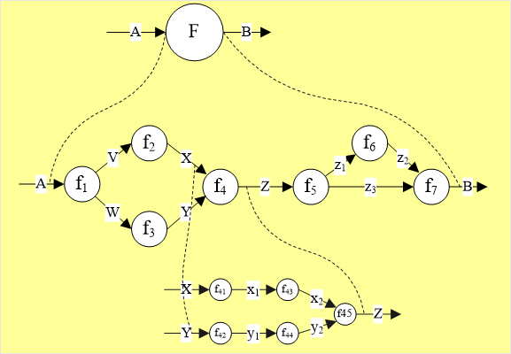
  * 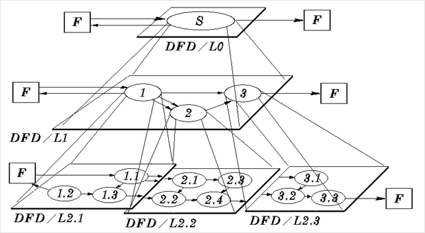

* 数据流图的绘制步骤：

  * 找系统的数据源点与汇点。他们是外部实体，确定系统与外界的接口。
  * 找出外部实体的输出数据流与输入数据流。
  * 在途的边上画出系统的外部实体。
  * 从外部实体的输出数据流（系统的源点）出发，按照系统的逻辑需要画出逻辑加工，直到找到外部实体所需的输入数据流（系统的汇点）。

  e.g.

  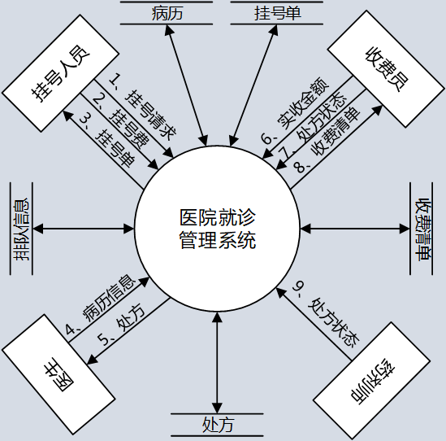

  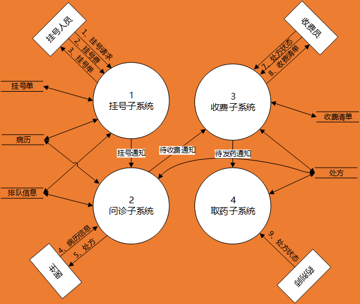

  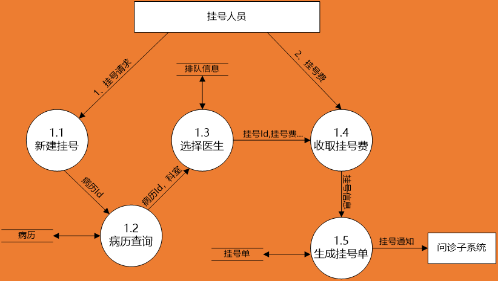

