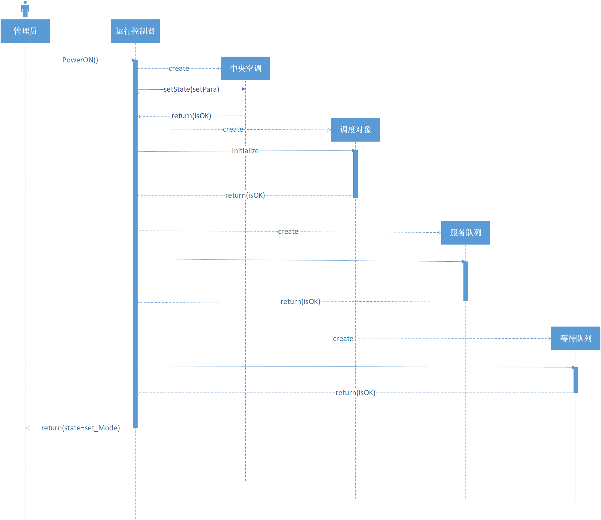
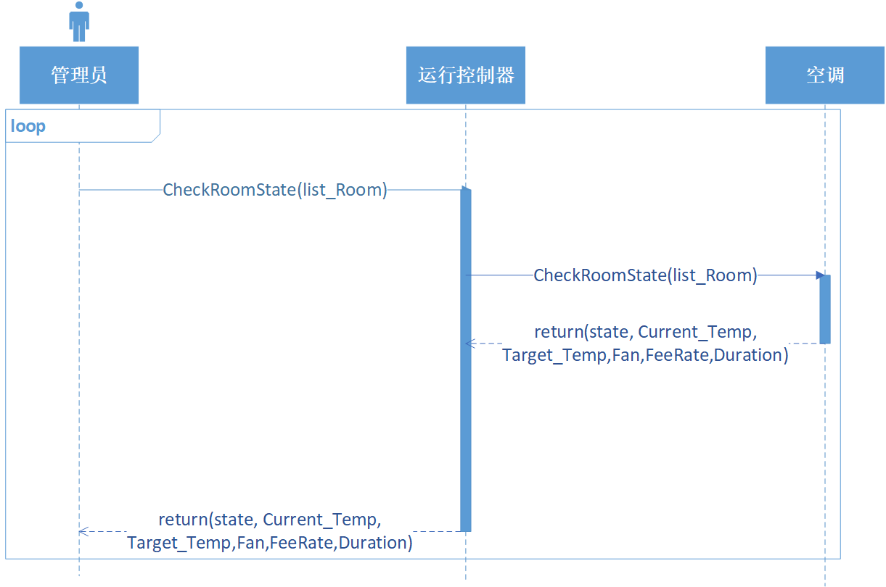
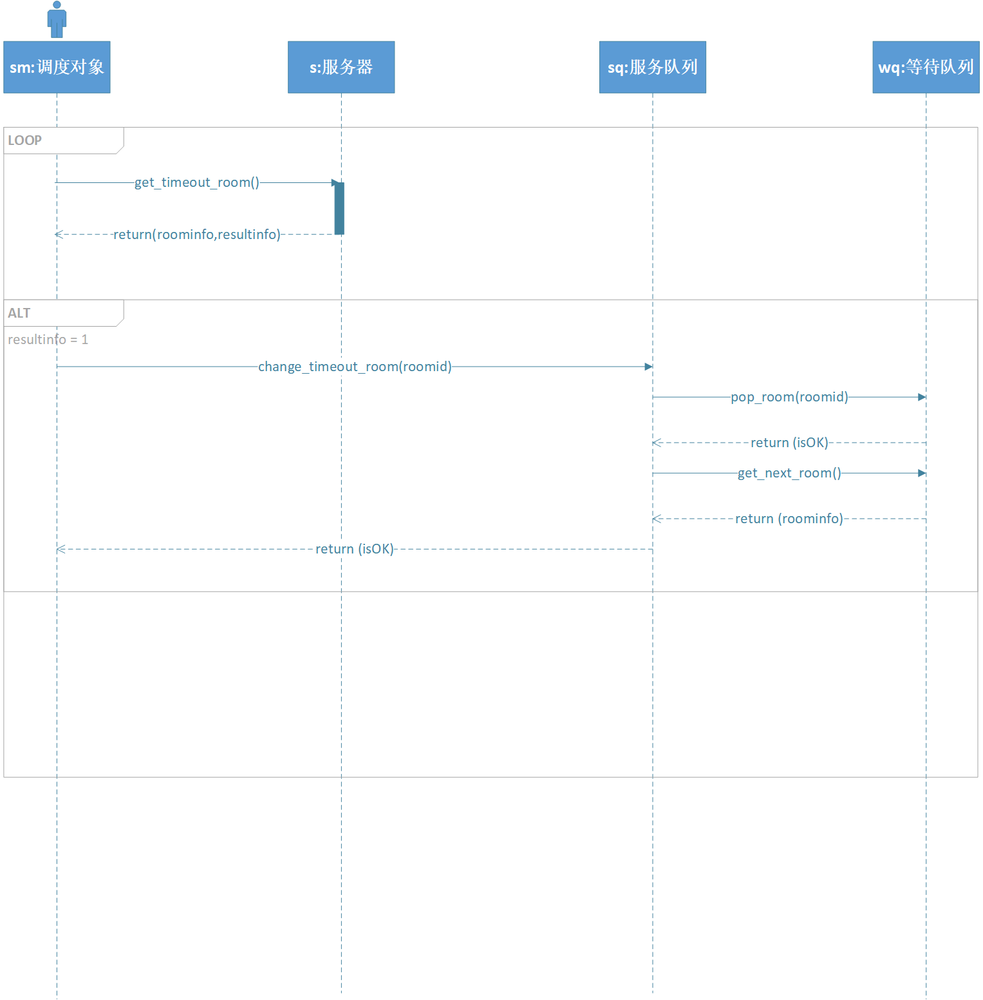

[toc]

# 1.文档介绍

## 1.1 文档目的
​		本文档旨在对分布式温控系统的四个角色及其SSD 对应系统事件的内容，给出空调计费系统的动态结构设计，并给出关于调度的动态设计，四个角色对应顾客、前台、管理员和酒店经理，其顾客打开空调、调节风速、调节温度；前台生成账单、详单；管理员打开中央空调，设置相应参数；经理查看报表等系统事件，对应从领域建模和用例模型向动态结构（sequence diagram）过渡。实现根据选择的分层结构，结合需求分析的结果找到各层次对应的软件对象，并给出了这些对象的交互场景。SSD 中的系统事件由控制器类进行接受，并经分析合法后，委托给相应的领域对象进行处理。本文档受众面广泛，从几个主要的系统角色出发描述各用例对应系统事件对应的对象以及其对象之间的相互关系，展现各用例的实现过程。对于软件设计人员，给出了各系统角色对应用例中所包含的对象以及相互之间的关系，为具体设计和程序设计提供依据对于编码人员，根据各对象和相互关系进行代码实现；对于测试人员，可以根据相应sequence diagram 确定系统功能是否完备、性能是否高效，以利于在软件的后续版本补充设计。

## 1.2 文档范围

​		本文档从项目背景、领域模型、操作契约和动态结构这几个方面进一步描述分布式温控系统。主要的参与者包括酒店经理、酒店中央空调管理员、酒店前台和顾客。文档首先从系统角色出发，依据领域模型和用例模型（主要的操作契约），通过面向对象的设计思维，实现系统的动态结构设计。对应确定用例的每一个系统事件确定的软件对象，并通过采用UML 中的sequence diagram 来展示和确定对象之间的关系情况。

## 1.3 读者对象

​		本说明书的读者对象包括客户代表（即需求方，也即BUPT酒店管理方）以及软件开发方（即项目产品经理、设计人员、编码人员、测试人员和维护人员等）

## 1.4 参考文档

1. 本小组《用户需求说明及领域模型》《用例模型》
2. 肖丁，修佳鹏. 软件工程模型与方法（第2 版）[M]. 北京：北京邮电大学出版社,2014.08.

## 1.5 术语约定

 * 空调管理员：空调管理员负责空调的运行和维护。
 * 用户：入住酒店并使用本系统的顾客。
 * 出风口：即分布式中央空调系统的室内出风口。
 * 客户端：在本项目中，客户端终端用于给客户提供图形化界面以调整其房间内的空调设定和计费。
 * 服务员端：在本项目中，用于给酒店方人员提供图形化界面以进行空调状态查询，报表查看，详单打印等功能。
    * 空调管理员端：用于给空调管理员提供图形界面来进行空调开机和运行，监控各客房的分机的运行状态；
    * 前台端：用于给前台提供图形界面来进行接待顾客、办理顾客酒店入住、办理顾客退房以及出具账单和详单；
    * 酒店经理端：用于给酒店经理提供图形界面来进行全面负责酒店的运营并关注酒店的空调的运营数据：日报、周报
 * 用例：参与者为了完成某些特定的任务而必须执行的一系列动作的合集。
 * 问题域边界：用来说明当前讨论用例图应用的范围，用一个矩形表示。
 *  用例图：由参与者、用例，边界以及它们之间的关系构成的用于描述系统功能的
视图。
 * SSD 系统顺序图（System Sequence Diagram）
 * Server 服务对象，用于为每个房间的请求提供服务
 * 调度对象，在请求资源超标之时，借助资源调度策略进行调度

# 2.项目背景

​		波普特（BUPT）廉价酒店位于帝都五环外的大学城附近，周边环境优美清幽，适合旅游度假放松心情。该酒店成立于2000年，经过10年的经营积攒了良好的声誉，为了响应政府绿色环保经营的理念，期望构建空调温控计费系统：推崇多用多付出，少用少付出，不用不付出的计费模式，节省成本的同时使得顾客随时能查看已消费的金额，做到心中有数节省开支的目的，进一步吸引年轻人入住。顾客入住酒店时需要提供身份证，可以预约登记或者现场申请办理入住。经过前台接待人员的身份核查后，根据顾客入住的天数需缴纳一定的押金，之后前台进行登记安排客房并提供门卡及wifi密码。中央空调运行期间维护人员通过顾客的投诉和报修信息进行空调问题的处理，无法及时掌控各房间空调的运行情况。由于空调处理能力的问题（假定，同一时间只能提供3个房间的温控请求），短时间内又不能改装并提升空调的功率且又不方便向顾客直言其中的原因，为此希望新系统具有动态分配空调资源的能力，以便顾客不会感受到其中的不便之处。该酒店由于规模有限不提供餐饮服务，但客房中会提供必备的瓶装矿泉水及热水壶等基本设备。酒店提供集中式空调，客房具有空调的控制面板和出风口。顾客进入房间后通过门卡接通房间电源。当顾客离开酒店退房时，前台负责结算房费，当前在没有引入新系统的情况下前台只负责收取房费，房费包含了空调使用费，尽管顾客没有使用空调也会默认收取。

# 3.动态结构设计

## 3.1.客户

### 3.1.1 系统事件PowerOn(RoomId,CurrentTemp)

操作契约：
1. 一个新的（概念类）空调对象实例被创建；
2. 客户（概念类）与空调对象（概念类）建立关联；
3. 一个新的（概念类）详单对象实例被创建；
4. 一个新的（概念类）计时器对象被创建；
5. 空调对象的状态、服务开始时间、工作模式、房间当前温度、目
标温度、风速、费率、当前费用、总费用被赋值；

### 3.1.2 系统事件RequestState(Roomid)

操作契约：
1. 当前的空调对象实例的属性：房间当前温度、当前费用、总费用
被修改；

### 3.1.3 系统事件Table ChangeTargetTemp(RoomId,TargetTemp) 

操作契约：
1. 当前空调对象实例的属性：目标温度被修改；

### 3.1.4 系统事件ChangeFanSpeed(RoomId,FanSpeed)

操作契约：
1. 当前空调对象实例的属性：风速、费率被修改；
2. 空调对象实例与详单（概念类）对象实例建立关联；
3. 一条详单记录被写入到详单（详单对象的各属性被赋值）；

### 3.1.5 系统事件PowerOff(RoomId)

操作契约：
1. 空调对象实例与详单建立关联；
2. 一条详单记录被写入到详单对象实例中（详单对象的各属性被赋值）
3. 空调对象实例被删除；

### 3.1.6 系统事件RequestRelease(RoomId)

操作契约：
1. 服务对象被删除；
2. 服务对象与客户对象之间的关联被删除；
3. 一条详单记录被写入到详单（详单对象的各属性被赋值）

### 3.1.7 系统事件RequestTempUp()

操作契约：
1. 服务对象被创建；
2. 服务对象与客户对象之间的关联被建立；
3. 服务对象的当前室温属性值被修改。

## 2.前台

### 3.2.1 系统事件CreateInvoice(RoomId,date_in,date_out)

操作契约：
1. 一个新的空调对象被创建；
2. 一个新的账单对象被创建；
3. 账单对象与空调对象建立关联；
4. 空调对象与详单对象建立关联；
5. 账单对象的总费用值，入住时间，退房时间被赋值；

### 3.2.2 系统事件PrintInvoice(InvoiceId)

操作契约：
1. 账单文件对象被创建
出

### 3.2.3 系统事件CreateRD(RoomId,data_in,date_out)

操作契约：
1. 一个新的空调对象被创建；
2. 一个新的详单对象被创建；
3. 详单对象与空调对象建立关联；
4. 详单对象的请求时间，请求时长，风速，费率，费用被赋值；

### 3.2.4 系统事件PrintRD(RoomId,List_RD)

操作契约：
1. 详单文件对象被创建

## 3.空调管理员

### 3.3.1 系统事件PowerOn()

操作契约：
1. 一个空调对象被创建；
2. 空调对象的状态被赋值为参数设置状态

### 3.3.2 系统事件setPara()

操作契约：
1. 空调对象的工作模式、温控范围、缺省的目标温度、缺省的风速、费率被赋值；

### 3.3.3 系统事件StartUp()

操作契约：
1. 空调对象的状态被修改为：Ready

### 3.3.4 系统事件CheckRoomState(list_Room)

操作契约：
1. 监控对象（概念类）被创建
2. 监控对象与服务对象（空调实例对象）建立关联
3. 监控对象的各属性被赋值：工作模式、当前室温、目标温度、风速、服务时长、当前费用、总费用、房间服务状态

## 4.经理

### 3.4.1 系统事件QueryReport(list_RoomId,type_Report,date1,date2)

操作契约：
1. 统计对象（概念类）被创建
2. 统计对象与详单对象建立关联
3. 统计对象的各属性被赋值：开关次数，使用空调的时长，总费用，详单数，调温次数，调风次数

### 3.4.2 系统事件PrintReport(ReportId,date)

操作契约：
1. 报表文件（作为对象）被创建

## 5.调度部分交互设计

### 3.5.1 添加服务对象时的交互设计

调度策略：
调度对象负责接收空调客户端的请求，然后转发给服务对象进行温度计算和计费；
调度对象（可以认为是控制器对象）在系统服务器启动时进行实例化和初始化，需要创建两个队列：
   1、服务队列：记录房间号和服务对象的Id，风速以及服务时长；
   2、等待队列：记录房间号、风速和分配的等待服务时长。

基本的调度策略为：优先级调度+时间片调度。
优先级调度的依据是请求的风速，为此调度时首先考虑优先级策略；当所有请求的风速相同时，再进行时间片调度；

1、当服务对象数小于服务对象上限时，所有请求会被分配一个服务对象；
2、当服务对象数大于等于服务对象上限时，启动调度策略：
  首先判断是否符合优先级策略：请求服务的风速和服务对象的风速的大小：
    2.1、如果 判断=大于，则启动优先级调度策略，再判断有几个服务对象的风速低于请求风速：
	2.1.1 如果只有一个，则该房间被放置于等待队列，并被分配一个等待服务时长；服务对象被释放并被分配给新的请求对象；
	2.1.2 如果有多个服务对象的风速相等且低于请求对象，则服务时长最大的服务对象被释放并分配给新的请求对象，该房间被放置于等待队列，且分配一个等待服务时长；
	2.1.3 如果多个服务对象的风速低于请求风速，且风速不相等，则将风速最低的服务对象释放，该房间被放置于等待队列，且分配一个等待服务时长；
    2.2 如果 判断 = 相等，则启动时间片调度策略
	2.2.1 将请求对象放置于等待队列，并分配一个等待服务时长（假定为2分钟）；
	2.2.2 在这2分钟期间，如果没有任何服务状态的变化，当等待服务时长=0时
          将服务队列中服务时长最大的服务对象释放，该房间被放置于等待队列，且被分配一个等待服务时长；
          等待服务对象被分配一个服务对象开始服务；
	2.2.3 在这等待的两分钟期间内，如果有任何一个服务对象的目标温度到达或关机（意味着服务对象释放）
          则等待队列中的等待服务时长最小的对象获得服务对象；
	2.3 如果 判断 = 小于，则 请求对象必须等到某个服务对象空闲后才能得到服务。

下图中checkinfo = 0，1，2，3的情况分别对应：

* 服务队列未满
* 服务队列已满且新加入的服务对象风速大于队列中最小风速，从服务队列中选择风速最低的对象送入等待队列，并接受新的服务对象
* 服务队列已满且新加入的服务对象风速等于队列中最小风速，将请求对象放置于等待队列，并分配一个等待服务时长
* 服务队列已满且新加入的服务对象风速小于队列中最小风速，将请求对象放置于等待队列

### 3.5.2 在时间片分配时，有等待中的对象等待服务时间归零时的交互设计

定时向服务器查询是否有等待时间变为0的等待对象，并在有等待中的对象的等待时间归零时，进行服务队列和等待队列的修改。

