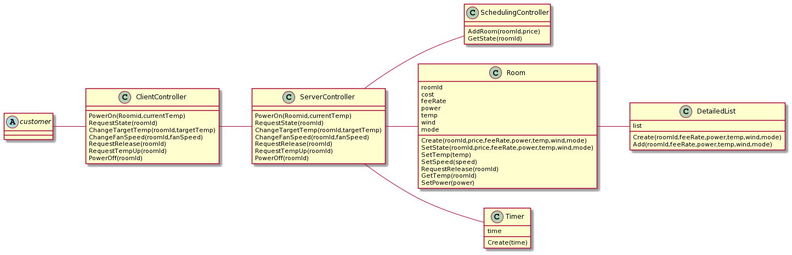
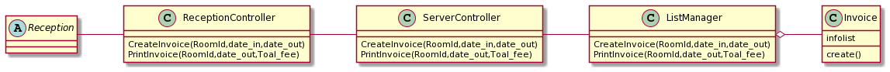
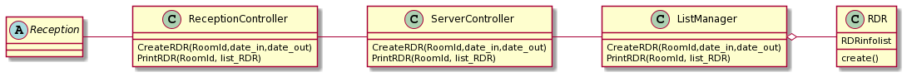
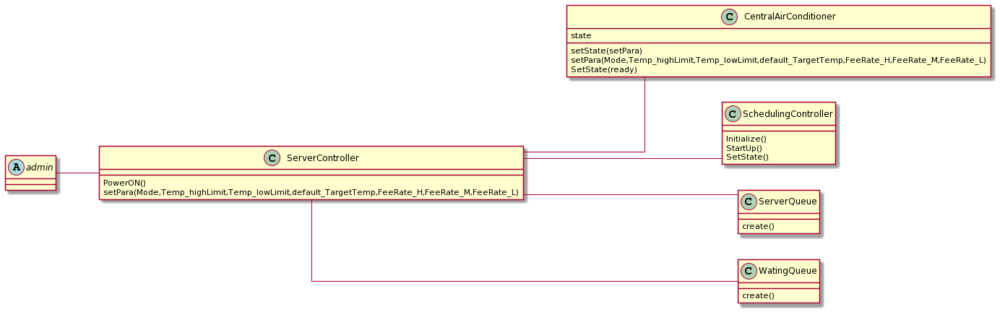
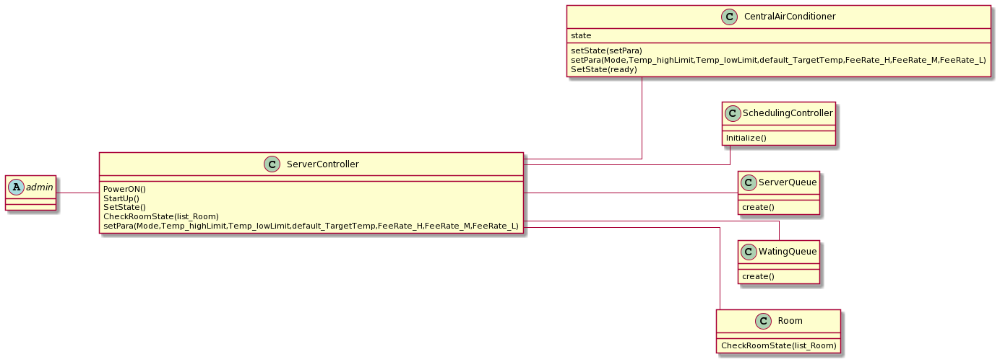
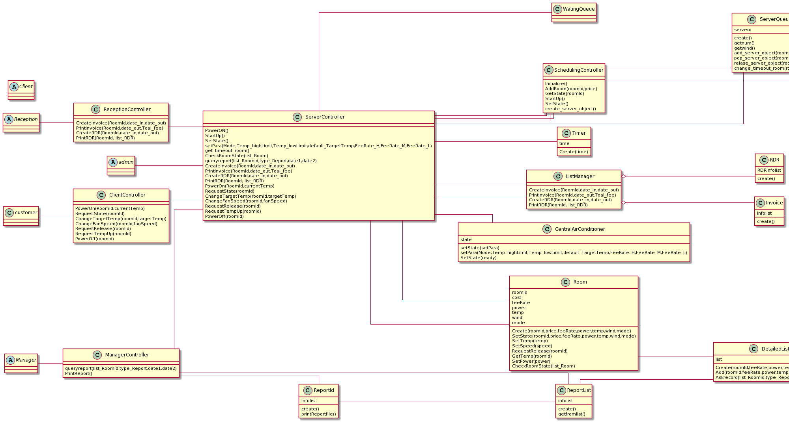

[toc]

# 1.文档介绍

## 1.1 文档目的

​		本文档旨在对分布式温控系统的静态结构设计进行描述，分别从用例和系统的角度给出静态结构设计，并基于系统级的静态结构类图要求给出每个软件类的说明：类的名称，类的属性说明，类的方法说明

## 1.2 文档范围

​		本文档从静态结构的方面进一步描述分布式温控系统。主要的参与者包括酒店经理、酒店中央空调管理员、酒店前台和顾客。文档首先从系统角色出发，依据领域建模、用例建模和动态结构设计，设计出每个用例的静态结构，进而设计出系统的静态结构

## 1.3 读者对象

​		本说明书的读者对象包括客户代表（即需求方，也即BUPT酒店管理方）以及软件开发方（即项目产品经理、设计人员、编码人员、测试人员和维护人员等）

## 1.4 参考文档

1. 本小组《用户需求说明及领域模型》《用例模型》
2. 肖丁，修佳鹏. 软件工程模型与方法（第2 版）[M]. 北京：北京邮电大学出版社,2014.08.

## 1.5 术语约定

 * 空调管理员：空调管理员负责空调的运行和维护。
 * 用户：入住酒店并使用本系统的顾客。
 * 出风口：即分布式中央空调系统的室内出风口。
 * 客户端：在本项目中，客户端终端用于给客户提供图形化界面以调整其房间内的空调设定和计费。
 * 服务员端：在本项目中，用于给酒店方人员提供图形化界面以进行空调状态查询，报表查看，详单打印等功能。
    * 空调管理员端：用于给空调管理员提供图形界面来进行空调开机和运行，监控各客房的分机的运行状态；
    * 前台端：用于给前台提供图形界面来进行接待顾客、办理顾客酒店入住、办理顾客退房以及出具账单和详单；
    * 酒店经理端：用于给酒店经理提供图形界面来进行全面负责酒店的运营并关注酒店的空调的运营数据：日报、周报
 * 用例：参与者为了完成某些特定的任务而必须执行的一系列动作的合集。
 * 问题域边界：用来说明当前讨论用例图应用的范围，用一个矩形表示。
 * 用例图：由参与者、用例，边界以及它们之间的关系构成的用于描述系统功能的
    视图。
 * SSD 系统顺序图（System Sequence Diagram）
 * Server 服务对象，用于为每个房间的请求提供服务
 * 调度对象，在请求资源超标之时，借助资源调度策略进行调度

# 2.静态结构设计

## 2.1 用例的静态结构设计

### 2.1.1 使用空调

### 2.1.2 出具账单

### 2.1.3 出具详单

### 2.1.4 运行空调

### 2.1.5 监视空调

### 2.1.6 查看报表

## 2.2 系统的静态结构设计

# 3 软件类说明

## 3.1 软件类 ClientController

描述：客户服务的控制器，用以响应客户的操作

属性：无

方法：

* PowerOn(Roomid,currentTemp)  响应空调开机操作，并转发请求到服务控制器

* RequestState(roomId) 响应状态查询操作并更新金额，并转发请求到服务控制器

* ChangeTargetTemp(roomId,targetTemp) 响应温度改变操作，并转发请求到服务控制器

* ChangeFanSpeed(roomId,fanSpeed) 响应风速改变操作，并转发请求到服务控制器

* RequestRelease(roomId) 响应服务对象释放操作，并转发请求到服务控制器

* RequestTempUp(roomId) 响应回温，并转发请求到服务控制器

* PowerOff(roomId) 响应空调关机操作，并转发请求到服务控制器

## 3.2 软件类 ServerController

描述：服务器的控制器，用以各类服务器响应的操作

属性：无

方法：

* PowerOn(Roomid,currentTemp)  响应空调开机操作
* RequestState(roomId) 响应状态查询操作并更新金额
* ChangeTargetTemp(roomId,targetTemp) 响应温度改变操作
* ChangeFanSpeed(roomId,fanSpeed) 响应风速改变操作
* RequestRelease(roomId) 响应服务对象释放操作
* RequestTempUp(roomId) 响应回温
* PowerOff(roomId) 响应空调关机操作
* CreateInvoice(RoomId,date_in,date_out)  响应创建帐单请求
* PrintInvoice(RoomId,date_out,Toal_fee) 响应打印帐单请求
* CreateRDR(RoomId,date_in,date_out) 响应创建详单请求
* PrintRDR(RoomId, list_RDR) 响应打印详单请求
* PowerON(）响应中央空调开机
* StartUp() 响应中央空调的起步
* SetState() 修改中央空调状态
* setPara(Mode,Temp_highLimit,Temp_lowLimit,default_TargetTemp,FeeRate_H,FeeRate_M,FeeRate_L) 响应赋值空调的缺省工作模式，包括初始温度，温度上限下限，不同风速的费率等 
* queryreport(list_Roomid,type_Report,date1,date2) 进行报表详单查询
* get_timeout_room() 获取超时房间
* CheckRoomState(list_Room) 获取房间状态

​      

## 3.3 软件类 SchedulingController

描述：调度控制器，用以进行空调调度操作

属性：无

方法：

* Initialize() 初始化
* StartUp() 调度控制器启动
* SetState() 修改调度器状态

* AddRoom(roomId,price) 新增服务对象
* GetState(roomId) 响应查询房间对应服务对象状态
* create_server_object() 创建服务对象

## 3.4 软件类 Room

描述：描述房间的类，在本设计中与该房间内的空调绑定

属性：

* 房间ID：roomId
* 累计价格：cost
* 计费率：feeRate
* 开关机：power
* 温度：temp
* 风速：wind
* 模式：mode

方法：

* Create(roomId,price,feeRate,power,temp,wind,mode) 创建新的房间类

* SetState(roomId,price,feeRate,power,temp,wind,mode)  修改房间信息

* SetTemp(temp) 修改房间设定温度

* SetSpeed(speed) 修改房间设定风速

* RequestRelease(roomId) 释放房间对应服务对象

* GetTemp(roomId) 获得房间温度

* SetPower(power) 设定开关机状态
* CheckRoomState(list_Room) 监控房间

## 3.5 软件类 Timer

描述：用以计时的计时器

属性：

* 时间：time

方法：

* create(time) 创建计时器

## 3.6 软件类 DetailedList

描述：描述详单的类

属性：

* 详单：list

方法：

* Create(roomId,feeRate,power,temp,wind,mode) 创建详单实例
* Add(roomId,feeRate,power,temp,wind,mode) 添加详单记录
* Askrecord(list_Roomid,type_Report,date1,date2) 按时间查询详单记录

## 3.7 软件类 ReceptionController

描述：前台服务的控制器，用以响应前台的操作

属性：无

方法：

* CreateInvoice(RoomId,date_in,date_out) 响应创建帐单请求，并转发请求到服务控制器
* PrintInvoice(RoomId,date_out,Toal_fee) 响应打印帐单请求，并转发请求到服务控制器
* CreateRDR(RoomId,date_in,date_out) 响应创建详单请求，并转发请求到服务控制器
* PrintRDR(RoomId, list_RDR) 响应打印详单请求，并转发请求到服务控制器

## 3.8 软件类 Invoice

描述：描述账单的类

属性：

* 账单信息：infolist

方法：

* create() 创建账单

## 3.9 软件类 RDR

描述：描述详单的类

属性：

* 详单信息：RDRinfolist

方法：

* create() 创建账单

## 3.10 软件类 ListManager

描述：进行详单账单查询抽取维护的类

属性：无

方法：

* CreateInvoice(RoomId,date_in,date_out) 从数据库中创建给定时间段的账单
* PrintInvoice(RoomId,date_out,Toal_fee) 打印给定时间段的账单
* CreateRDR(RoomId,date_in,date_out) 从数据库中创建给定时间段的详单
* PrintRDR(RoomId, list_RDR)  打印给定时间段的详单

## 3.11 软件类 CentralAirConditioner

描述：描述中央空调的类

属性：

* 状态：state
* Mode：初始模式
* Temp_highLimit：温度上限
* Temp_lowLimit：温度下限
* default_TargetTemp：初始温度
* FeeRate_H：高风速费用
* FeeRate_M：中风速费用
* FeeRate_L：低风速费用

方法：

* setState(mode) 更改中央空调状态
* setPara(Mode,Temp_highLimit,Temp_lowLimit,default_TargetTemp,FeeRate_H,FeeRate_M,FeeRate_L)  赋值空调的缺省工作模式，包括初始温度，温度上限下限，不同风速的费率等

## 3.12 软件类 ManagerController

描述：经理服务的控制器，用以响应经理的操作

属性：无

方法：

* queryreport(list_Roomid,type_Report,date1,date2)  响应详单查询请求，并转发请求到服务控制器

* PrintReport()  响应详单打印请求，并转发请求到服务控制器

## 3.13 软件类 ReportList

描述：统计报表的统计对象类

属性：

* 统计信息：infolist

方法：

* create() 创建统计对象

* getfromlist() 从统计对象中获取初步报表信息以生成报表

## 3.14 软件类 ReportId

描述：描述报表文件的类

属性：

* 报表信息：infolist

方法：

* create() 创建报表文件对象
* printReportfile() 打印报表文件

## 3.15 软件类 ServerQueue

描述：用以调度的服务队列

属性：

* 服务队列：serverq

方法：

* create()  创建服务队列
* getnum() 获取服务队列中服务对象数量
* getwind() 获取服务队列中最低风速
* add_server_object(roominfo) 向队列中添加服务对象
* relase_server_object(roominfo)  从服务队列中释放服务对象
* change_timeout_room(roomid) 弹出超时服务对象

## 3.16 软件类 WaitingQueue

描述：用以调度的等待队列

属性：

* 服务队列：waitingq

方法：

* create()  创建等待队列
* pop_server_object(roominfo) 从服务队列中弹出对象到等待队列
* add_waiting_status(roominfo) 添加服务对象到等待队列
* relase_waiting_status(roominfo) 从等待队列中释放服务对象
* get_next_room() 获取下一个优先级最高的房间

