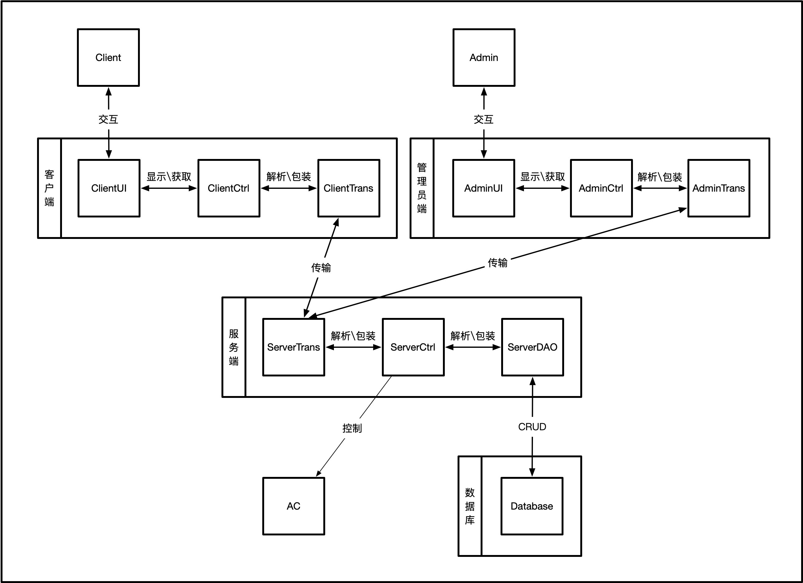

# 分布式温控计费系统	系统解决方案

小组：303e

----

[TOC]

----

## 开发总目标
### 背景		

某快捷廉价酒店响应节能绿色环保理念，推行自助计费式中央温控系统，使得入住的客户可以根据要求设定温度和风速的调节，同时可以显示所需支付的金额。客户退房时酒店须出具空调使用的账单及详单。空调运行期间，空调管理员能够监控各房间空调的使用状态，需要的情况下可以生成格式统计报表。

### 要求

要求设计成果可以完全满足该酒店的所有需求，并能提供趋于完善的解决方案和顺利长期稳定运行的可靠软件系统。

## 需求分析

### 功能需求

| 对象   | 要求                                                         |
| ------ | ------------------------------------------------------------ |
| 用户   | 开启和关闭空调、自行设定空调温度、风速；获取需支付金额信息；获取空调使用账单、详单； |
| 管理员 | 监控各房间空调使用状态；控制各个房间空调温度等；生成格式化空调使用统计报表； |

### 性能需求

| 性能部分       | 要求                                                         |
| -------------- | :----------------------------------------------------------- |
| 响应速度需求   | 响应速度快，保证计费和调整的实时性和瞬发性，平均响应时间应低于1s |
| 操作成功率需求 | 要求极高的调整和计费请求成功率，预期达到99.9%以上。          |
| 并发需求       | 需要能够在一个常规酒店规模的负载下稳定并发，即至少同时支持50名以上用户和10名以上管理员 |
| 稳定性需求     | 系统能在预期系统运行压力的情况下，不间断稳定运行，并且可以在故障时保留数据 |
| 差异性需求     | 考虑到管理员终端和用户终端在功能、负载和数量上的不同，理应出现一定程度的结构分化 |

### 环境需求

要求可以在常规配置下的主流商务计算机上运行。

### 接口需求

| 接口名称                     | 推送参数                     | 返回参数  | 接口备注                                 |
| ---------------------------- | ---------------------------- | -------- | --------- |
| 客户端向服务端发送数据接口   | 用户的空调调整指令及相关信息 | 成功/失败   | 客户端向服务端传输客户新的指令 |
| 服务端向客户端发送数据接口   | 该用户的所需支付金额         | 成功/失败   | 服务端向客户端发送该用户所需要付出的金额   |
| 管理员端向服务端发送数据接口 | 管理员需求类型和对关信息 | 成功/失败  | 管理员获取账单/格式报表/各房间空调使用状态 |
| 服务端向管理员端发送数据接口 | 管理员需求的对应信息               | 成功/失败 | 服务端响应管理员端需求 |
| 服务端向数据库发送数据接口 | 对应的CRUD操作类型 | 成功/失败 | 服务端获取数据库数据 |
| 数据库向服务端发送数据接口 | 上述操作的响应结果               | 成功/失败 | 数据库返回对应内容 |
| 服务器向空调发送控制信息接口 | 视空调待定 | 待定 | 控制空调的实际接口 |

## 技术路线

程序语言：Java

图形界面：暂未定

数据库：MySQL

通讯协议：Websocket

版本管理：Git，平台GitHub

### 系统架构

整体架构使用Client-Server模式，单一服务器+数据库提供多个客户端与管理端的服务。

对于客户端、管理端、服务端自身，采用MVC设计模式，分为：UI模块、数据传输模块、日志与异常管理模块、控制模块。

### 客户端

* ClientUI：
* 负责与用户交互，提供设定与显示AC（空调）温度、设定与显示空调风速、显示需支付金额的人机交互接口。
* ClientCtrl：
	* 提供基本逻辑验证功能：在发送接收数据时，拦截非法参数。
	* 程序逻辑：提供监控各个房间AC（空调）使用状态、控制任意房间空调温度与风速、打印各房间空调费用账单、打印各房间空调使用详单具体实现。
	* 控制客户端信息流动：发送数据时，负责从ClientUI获取信息，并将其包装为内部数据结构，传递给ClientTrans；接收数据时，负责解析ClientTrans传递来的数据，传递给ClientUI显示。
	* 本地日志记录：将操作日志保存到本地，也可上传至服务端。
* ClientTrans：
	* 发送数据时，负责包装ClientCtrl产生的数据结构，通过Websocket发送到服务端；接收数据时，负责解析服务端发送来的控制信息数据，并将其传递给ClientCtrl。

### 管理端

* AdminUI：
	* 负责与管理员交互，提供监控各个房间AC（空调）使用状态、控制任意房间空调温度与风速、打印各房间空调费用账单、打印各房间空调使用详单的人机交互接口。
* AdminCtrl：
	* 提供基本逻辑验证功能：在发送接收数据时，拦截非法参数。
	* 程序逻辑：提供监控各个房间AC（空调）使用状态、控制任意房间空调温度与风速、打印各房间空调费用账单、打印各房间空调使用详单的具体实现。
	* 控制管理端信息流动：发送数据时，负责从AdminUI获取信息，并将其包装为内部数据结构，传递给AdminTrans；接收数据时，负责解析AdminTrans传递来的数据，传递给AdminUI显示。
	* 本地日志记录：将操作日志保存到本地，也可上传至服务端。
* AdminTrans：
	* 发送数据时，负责包装AdminCtrl产生的数据结构，通过Websocket发送到服务端；接收数据时，负责解析服务端发送来的控制信息数据，并将其传递给AdminCtrl。
* 将客户端与管理端分离原因：考虑到客户端需要大规模部署，且一般为房间内的小型或嵌入式终端，合并管理端代码使得客户端存在冗余，造成空间浪费成本上升，且存在潜在安全风险。

### 服务端

* ServerTrans：
	* 接收数据时，负责解析客户端或管理端发送的数据，并将其传递给ServerCtrl；发送数据时，负责包装ServerCtrl产生的数据结构，通过Websocket发送到客户端或管理端。
* ServerCtrl：
	* 提供逻辑验证功能：在进行功能动作之前，验证传入数据合法性。
	* 程序逻辑：通过接口实际控制空调的运行；根据客户端与管理端的请求从数据库提取或写入数据。
	* 接收数据时，负责从ServerTrans获取信息，并将其解析为数据库可用格式，传递给ServerDAO；发送数据时，负责包装从ServerDAO传递来的数据，传递给ServerTrans。
	* 根据接收到的请求，控制AC（空调）的温度、风速等。
* ServerDAO：
	* 数据库访问对象，通过接口对数据库进行CRUD操作。

### 数据库

* 为系统产生的信息提供持久化保障，进行数据的热存储与冷备份。

## 系统性能评估

### 普通用户功能

1、**开启关闭空调**：

用户通过客户端开关空调，并将信息发送给服务器；服务器接收信息并修改空调状态然后返回信息给客户端，客户端回显信息。

注意：客户端保存空调当前开关的状态以区别此操作为开启还是关闭。

2、**设定空调温度**：

过程与 **开启关闭空调** 功能相似，只是发送的信息与修改的信息为空调温度。

注意：客户端根据保存的空凋开启关闭的状态以允许能否设定温度。

3、**设定空调风速**：

过程与 **设定空调温度** 功能无区别。

注意：客户端根据保存的空凋开启关闭的状态以允许能否设定风速。

4、**获取需支付金额信息**:

与收费规则有关（开启时长、空调温度风速），对用户每次开启关闭以及调温调速的操作，服务器都应该更新记录支付金额信息。可以每次用户操作就记录下此次操作的时间并将之前的金额累加进来；或者不记录时间服务器每隔一段时间（1-3分钟）根据空调状态的信息来累加金额,这样做会增加服务器负担，但能确保数据实时更新。

5、**获取空调使用账单、详单**:

与**获取需支付金额信息**功能相似，每次用户操作保存根据账单上需要提供的信息并根据设定的规则来计算。

### 管理员功能

1、**监控各房间空调使用状态**：

当管理员开启监控开关时，服务器需要周期性地将当前保存的用户空调状态的信息发送给管理员客户端。

注意：需要什么信息，服务器就要对每次普通用户的操作保存或更新相应的空调状态信息。

2、**生成格式化空调使用统计报表**

管理员发送信息请求空调使用统计报表，服务器查询数据库得到结果并返回给管理员。

注意：建立一个表记录用户空调使用时风速温度以及起止时间，每次用户操作就插入数据，每隔一段时间（如10天、20天）清理过期无用的数据。

### 系统性能估算

**操作延时**：

与硬件、网络、软件并发处理有关。

网络：使用内网从客户端到服务器来回约为30ms。

数据库操作：快的大约30ms，慢的100ms。

客户端处理：一般都比较快，可忽略。

服务器处理：与并发设计有关。

以上看来，操作延时可以控制在1s内，并且设计合理的话可以控制在300ms内。

**系统承载量**：

主要考虑因素为普通用户与服务器交互。

在同时支持50名以上用户并发需求上，并将操作时延控制在1s内，也就是说一秒钟能同时支持50个用户并发，假设5%的用户会在一秒内同时操作，那么系统承载量大约为1000。

## 时间及人力资源安排

### 本报告人员分工

林麒：需求分析
马嘉骥：方案设计/技术路线
覃驰宇：可行性/系统性能评估
许哲诚：时间及人力资源安排

### 项目安排

<table border= "1px" >
    <caption>时间规划</captiosdn>
    <tr>
        <th>  三月底前   </th>
        <td colspan="2">完善用户需求分析构造合适的领域模型 </td>
    </tr>
    <tr>
        <th rowspan="2"> 四月 </th>
        <th>  四月初   </th>
        <td>完成系统的用例模型设计，学习相关的Java知识，开始设计数据库 </td>
    </tr>          
    <tr>
        <th>  四月底前 </th>
        <td>设计模型的动态结构设计，完成对数据库的表项等的设计，构建好数据库部分，对编码所需要的Java知识完成相应的学习 ，与大组内的其他小组统一好服务端与客户端间的数据传输端口名与数据传输格式以及传输协议</td>
    </tr>
    <tr>
        <th rowspan="3"> 五月</th>
        <th>  五月初   </th>
        <td>设计模型-静态结构设计，划分好相应的模块，将任务分配给个人，每个人开始编写相应的模块</td>
    </tr>   
     <tr>
        <th>  五月中下旬 </th>
        <td>每个人完成各自负责的代码部分并完成模块测试，整合小组的代码，确保能完成系统的所有基础需求，在小组内进行测试，修改完善系统</td>
    </tr>   
    <tr>
        <th>  五月底 </th>
        <td>其他小组一起进行组间的测试，有增加或改动的需求这时侯对代码进行相应的增加以及修改，调试好系统</td>
    </tr>  
    <tr>
        <th>  6.11前   </th>
        <td colspan="2">不断完善系统，确保小组间测试正常，力争验收时不出现任何的bug，等待验收</td>
    </tr>   
</table>

### 人力资源安排

   - 采用Java来编写本次系统，开始时小组成员要自学相关的Java知识
   - 大致上两人负责前端三人负责后端，讲代码划分为相应的模块（客户，管理员，空调三个部分）分给个人去完成编写
	- 数据库的相关部分在开始编写代码前会提取完成
	- 编写完各自负责的代码后，也要完成对自己编写的模块的测试，完成早的协助他人测试
	- 将测试好的模块进行整合，进行系统的综合测试（由大家一起来完成）

